# VMware - Install Ubuntu Server

* #### Isi Nama File dan Pilih Ubuntu 64 Bit
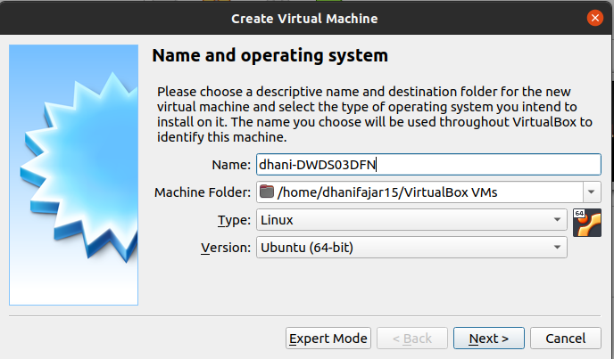

* #### Pilih Memory 1 Gb karena hanya untuk keperluan server
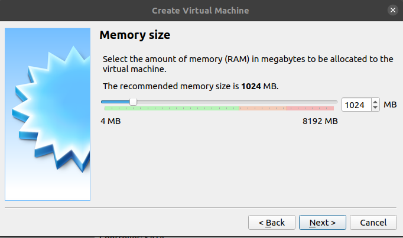

* #### Create Virtual Hard disk
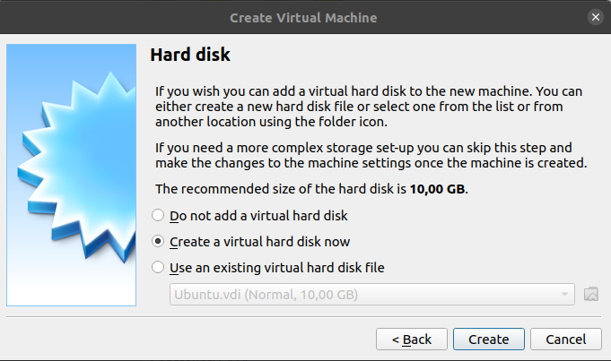

* #### Pilih VDI ( VirtualBox Disk Image)
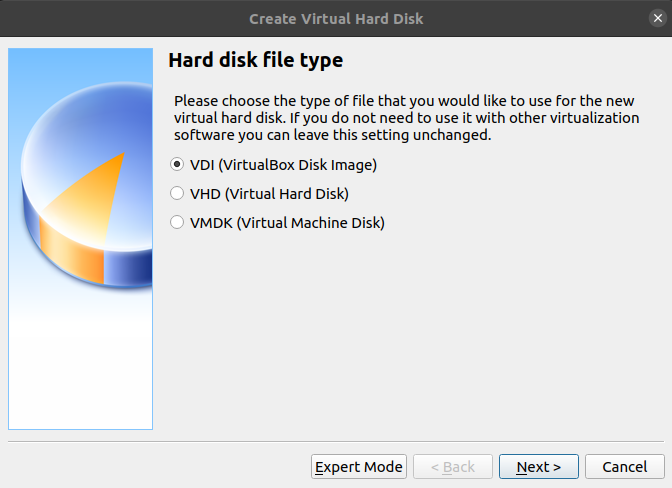

* #### Pilih Dynamic Allocate
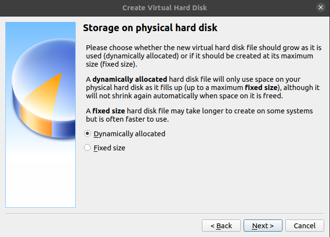

* #### Pilih Size 8 GB
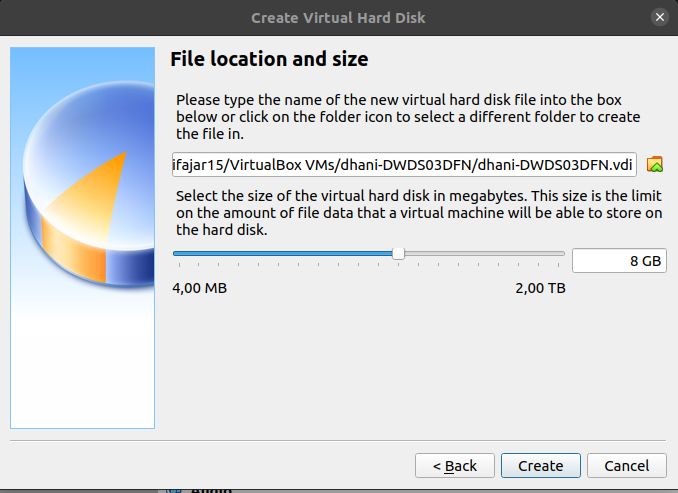

* #### Cek interface yang sedang terkoneksi ke internet, disini saya memakai wireless lan (wlp3s0)
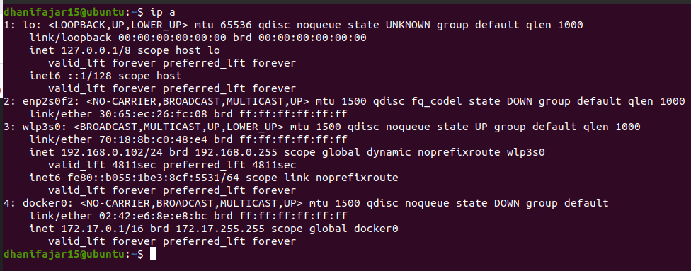

* #### Klik Setting Ubah Network menjadi Bridge
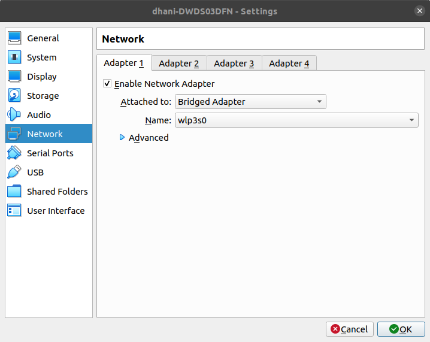

* #### Klik Storage Pilih ISO Ubuntu 18.04
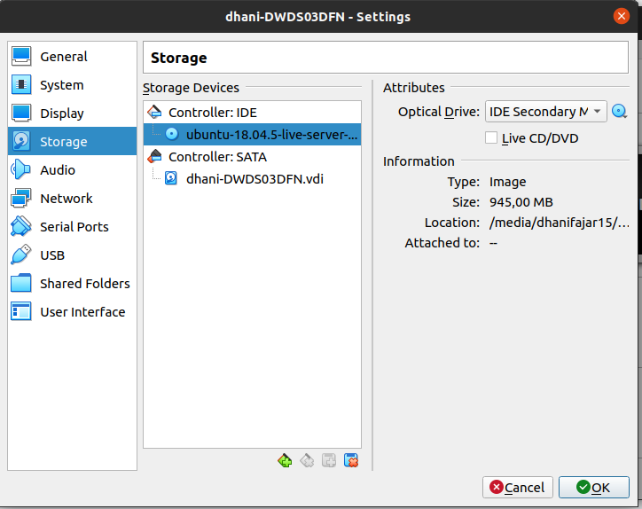

* #### Lalu Klik Start
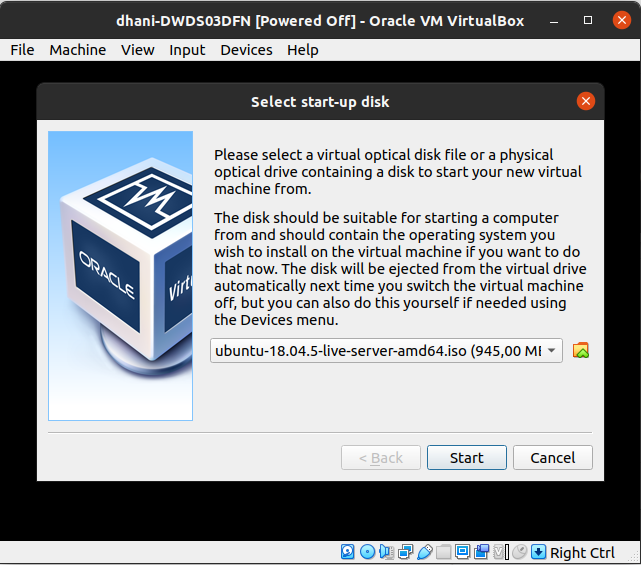

* #### Lalu Pilih Bahasa Inggris dan Continue Without Updating
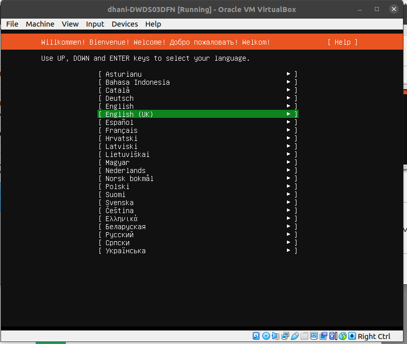
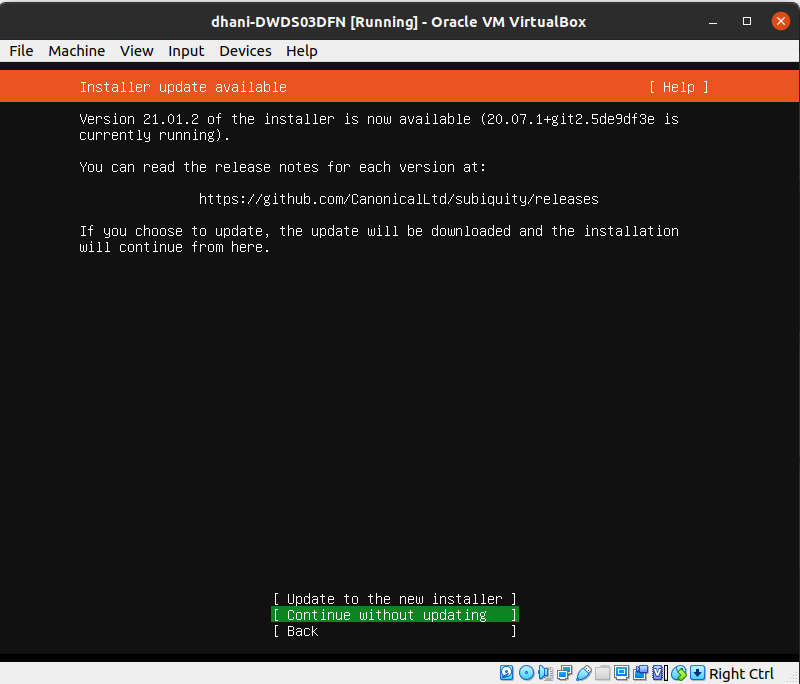

* #### Lalu Klik Done Pada Pengaturan 
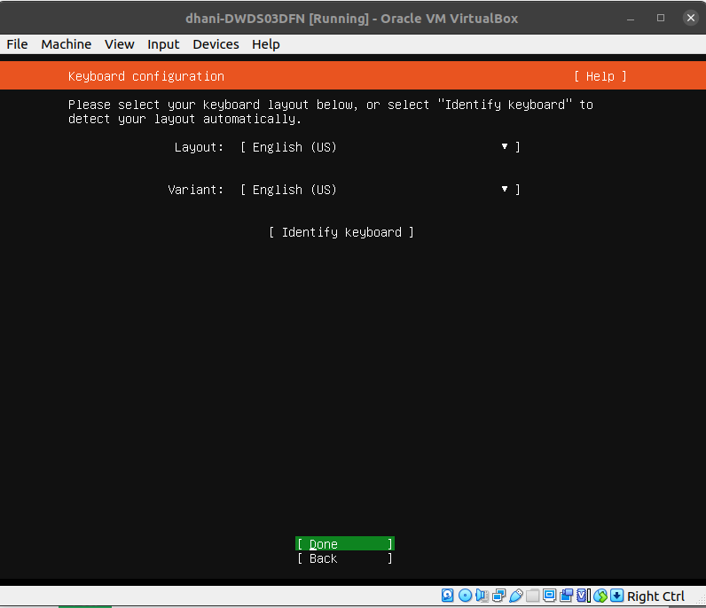
* #### Cek IP laptop pada interface wlp3s0 untuk membuat ip static
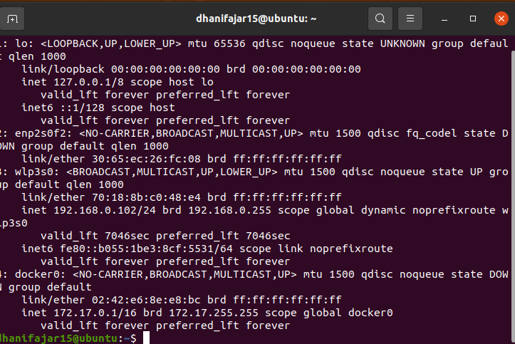
* #### Cek Gateway 
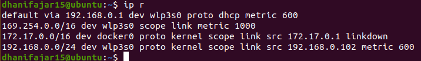
* #### Edit network connection dengan settingan IPv4 manual
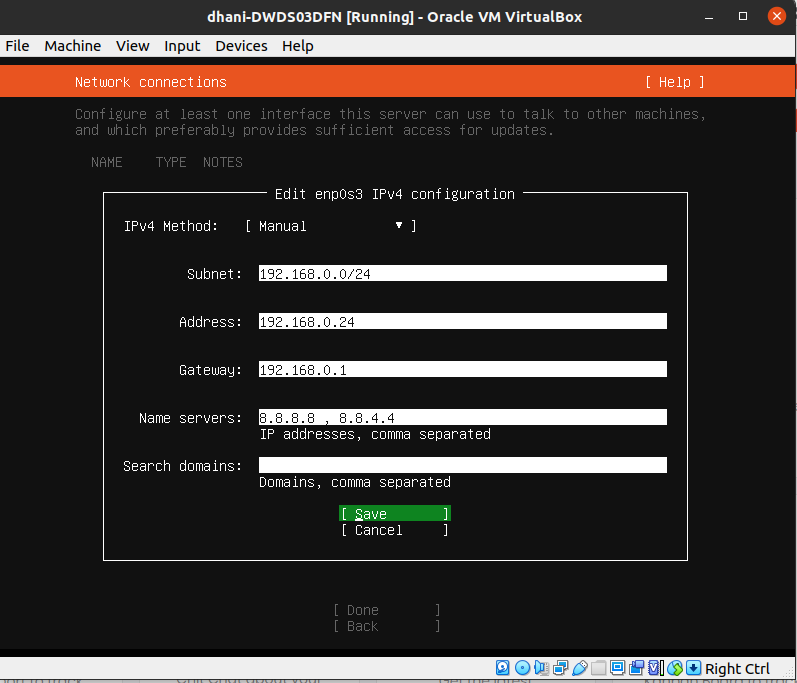
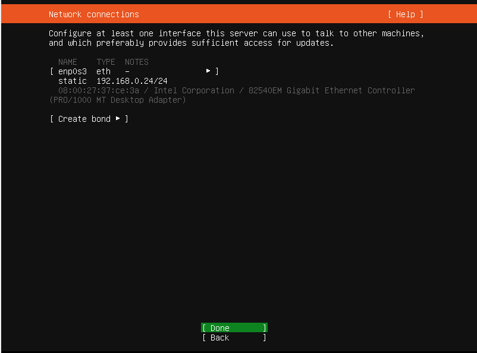

* #### Done saja pada Configure Proxy dan Ubuntu Mirror
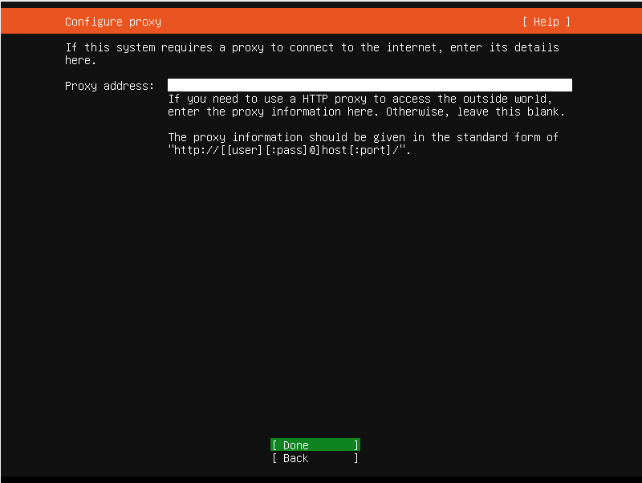

* #### Pilih Adding GPT Partition 1 GB Untuk Format Swap dan Sisanya Untuk Format Ext4
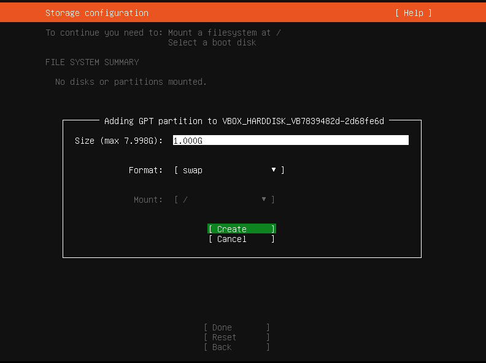
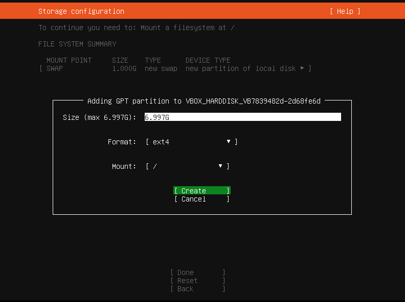

* #### Kemudian Done dan Pilih Continue
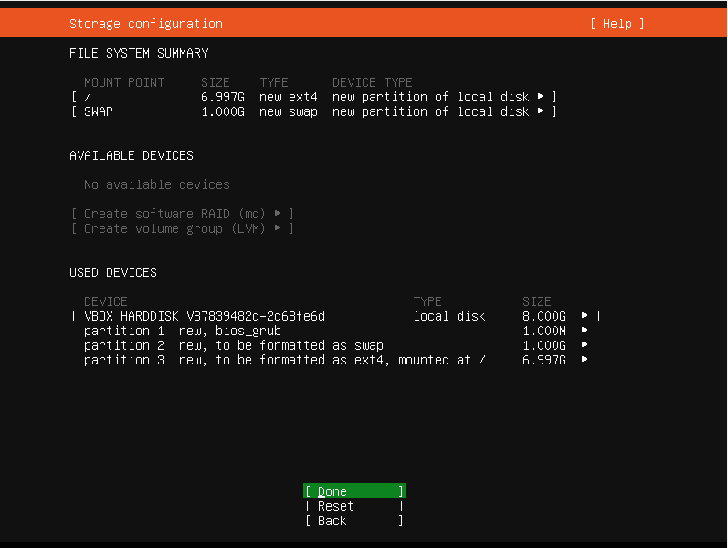

* #### Isi Profile
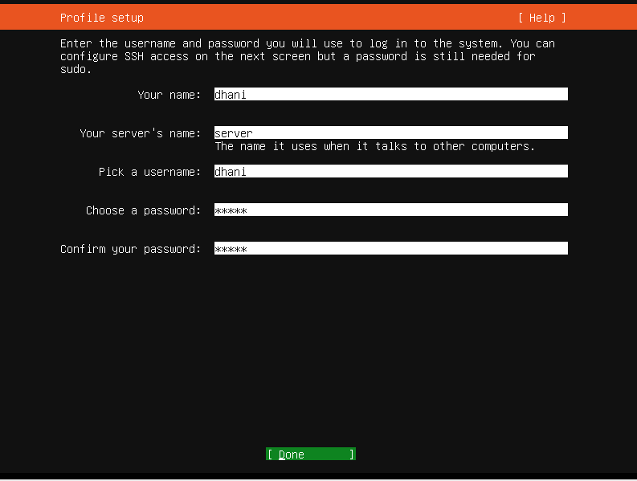

* #### Pilih Ceklis atau X untuk Install OpenSSH Server
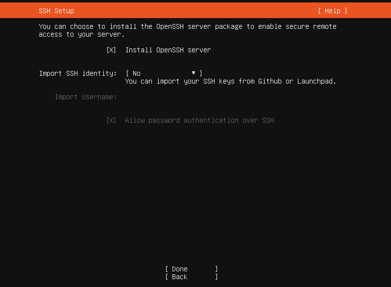

* #### Klik Done saja pada Featured Server Snaps
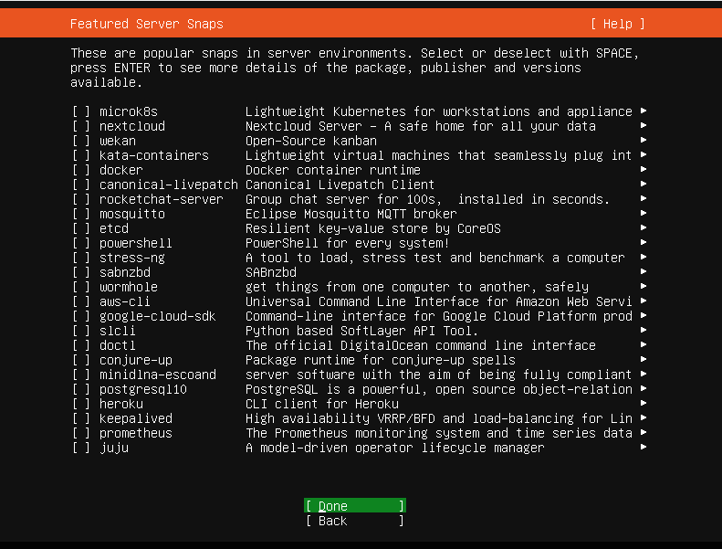

* #### Kemudian Pilih Done dan Menunggu Install dan Reboot Server
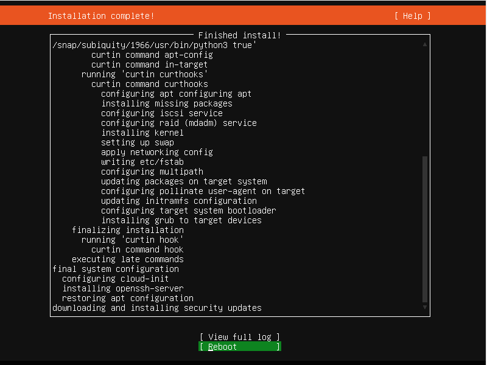