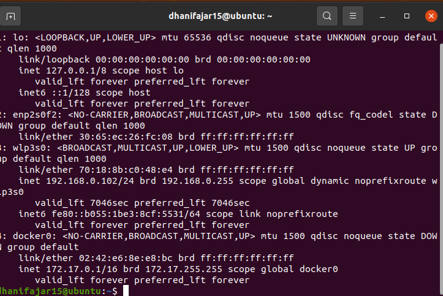
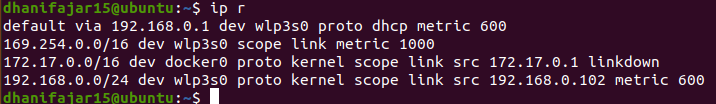
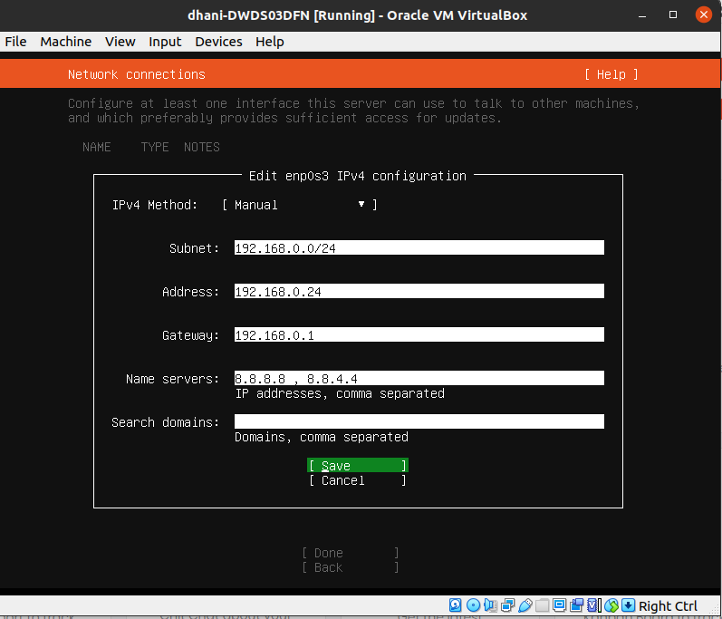
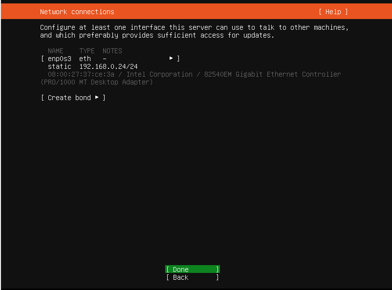

# VMware - Setup Network

* #### Ubah IP Menjadi Static dengan setting IPv4 secara manual pada saat instalasi Ubuntu Server

* #### Cek IP laptop pada interface wlp3s0 untuk membuat ip static

* #### Cek Gateway

* #### Edit network connection dengan settingan IPv4 manual

