# VMware - Install Application

* #### Login ke Ubuntu Server pada VMware
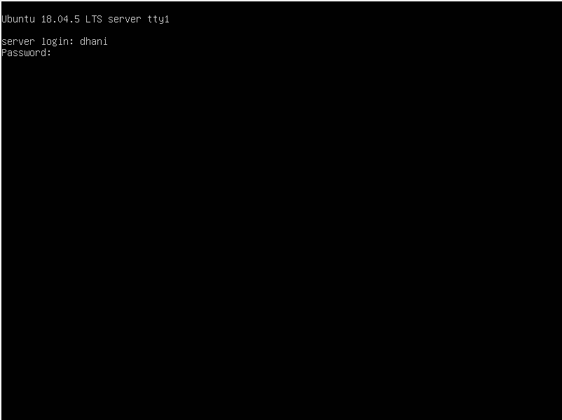
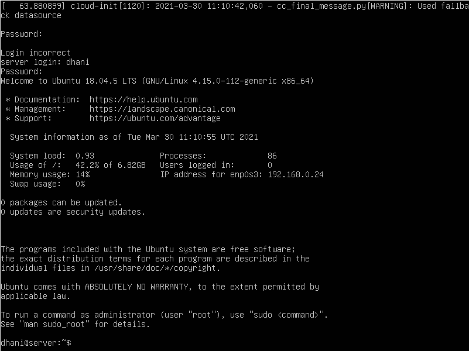

* #### Remote server dari client denga SSH Server dan coba ping untuk cek koneksi 
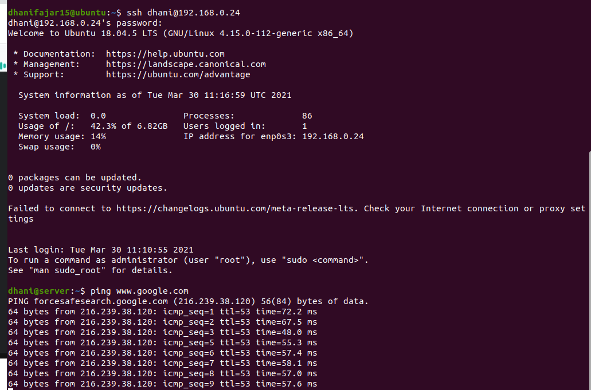

* #### Update Server menggunakan Command
    `sudo apt-get update`

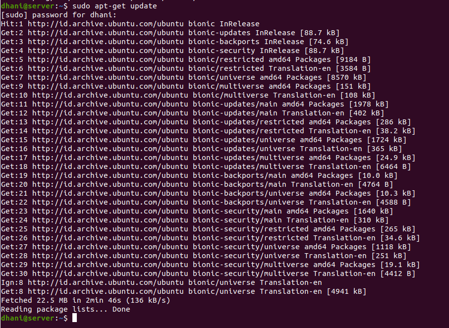

* #### Install Nginx Menggunakan Command dan coba cek nginx dengan curl localhost
    `sudo apt -y install nginx`

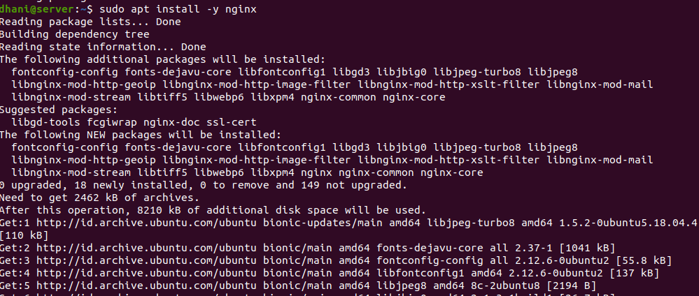
* #### Tes Nginx pada browser dengan memasukkan IP server pada url
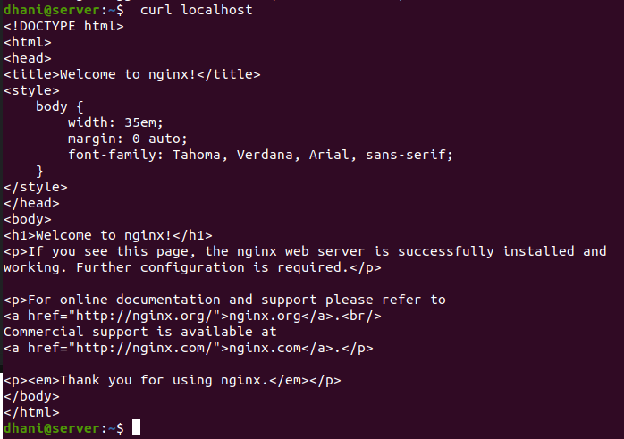

* #### Install nvm Menggunakan Command
    ```
    curl -o- https://raw.githubusercontent.com/nvm-sh/nvm/v0.38.0/install.sh | bash
    ```


* #### Cek versi nvm yang tersedia
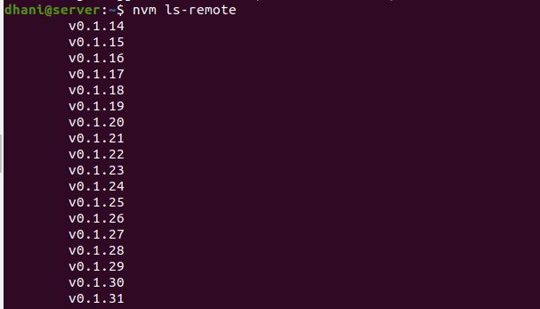
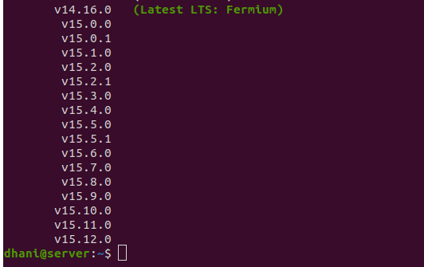

* #### Install node dengan versi lts paling terbaru
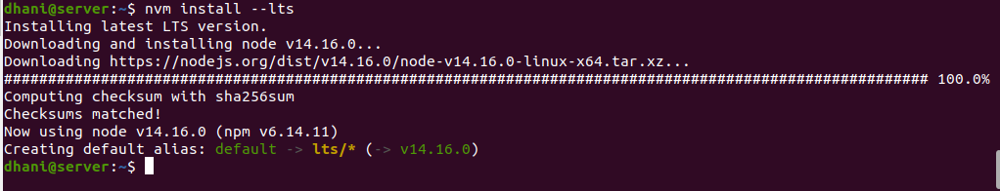

* #### Cek versi node dan nvm
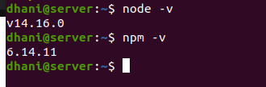

* #### Clone Repo Library dan Masuk Ke Direktori dengan menggunakan Command
    `git clone https://github.com/sgnd/wayshub-frontend`

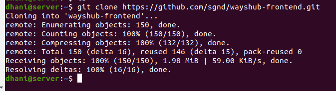

* #### Lakukan Install npm package dan deploy dengan Command
    ```
    npm install
    npm start
    ```

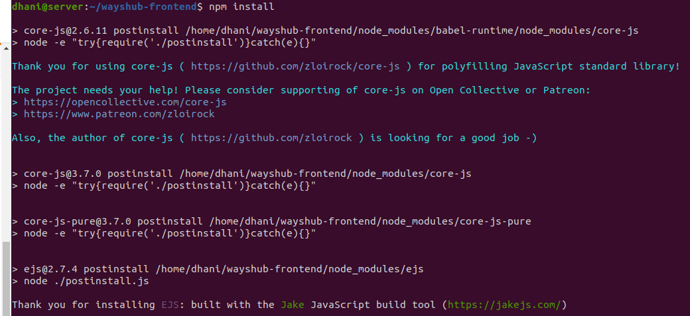
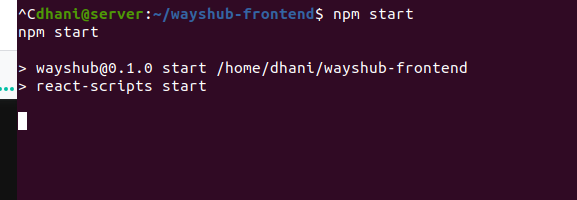
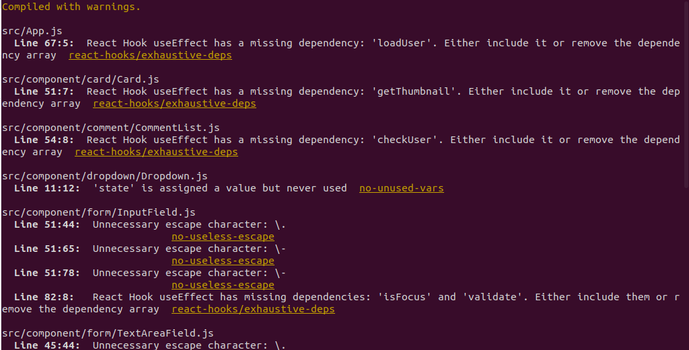

* #### Buka Browser Masukkan Ip Adresses dengan port 3000

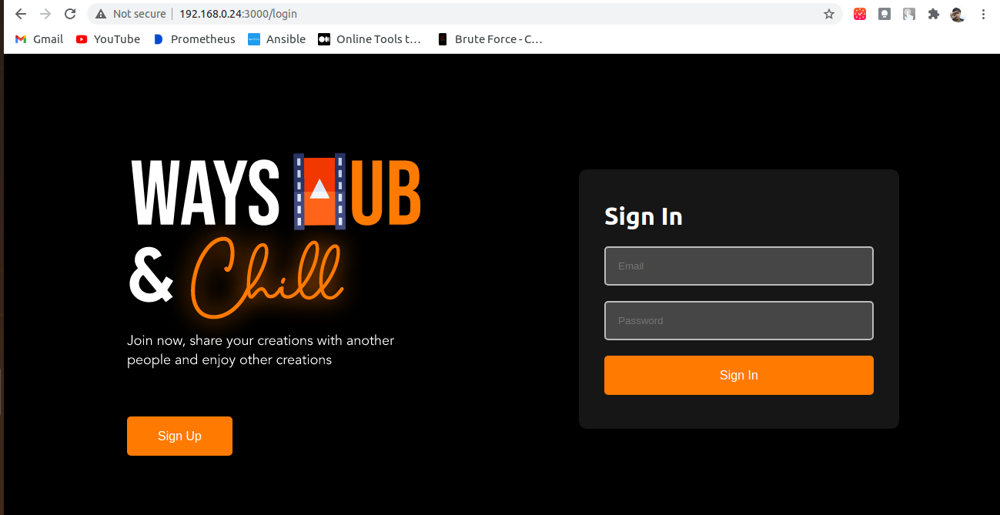
