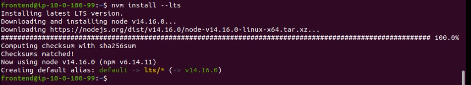

# AWS - Server for Application

#### 1. Deploy Aplikasi Wayshub di Server Frontend 
SSH ke Server Frontend Melalui Public Server


Update dan Upgrade OS dengan Command
```
sudo apt update && sudo apt -y upgrade
```  


Kemudian Install nvm dengan Command
```
curl -o- https://raw.githubusercontent.com/nvm-sh/nvm/v0.38.0/install.sh | bash
```


Pastikan nvm sudah terinstall dengan memverifikasinya


Cek available versi node


Install nvm dengan versi lts paling latest


Melihat nvm yang sudah terinstall


Cek versi node dan npm


Clone Repo Library dan Masuk Ke Direktori dengan menggunakan Command
```
git clone https://github.com/sgnd/wayshub-frontend.git
```


Kemudian install module dengan command
```
npm install
```


Kemudian Install npm pm2 dengan command
```
sudo npm install -g pm2
```


Kemudian generate file ecosystem.config.js dengan command 
```
pm2 ecosystem
```


Edit file ecosystem.config.js


Kemudian Jalankan pm2 dengan command 
```
pm2 start ecosystem.config.js
```


