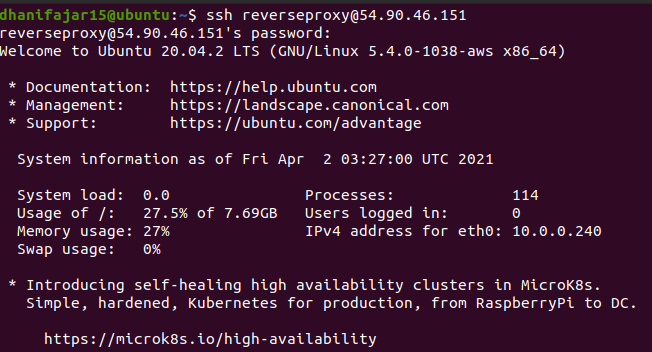
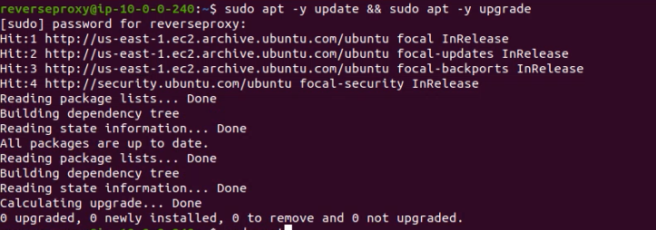
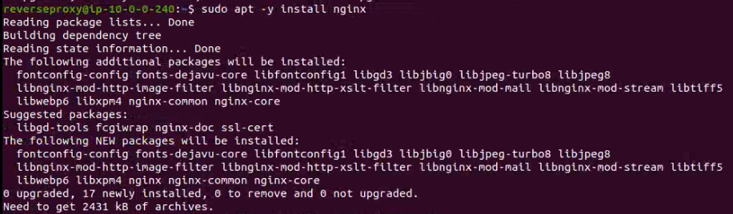
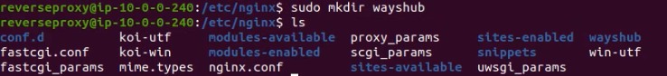
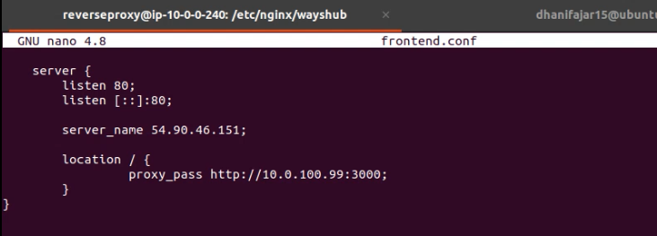
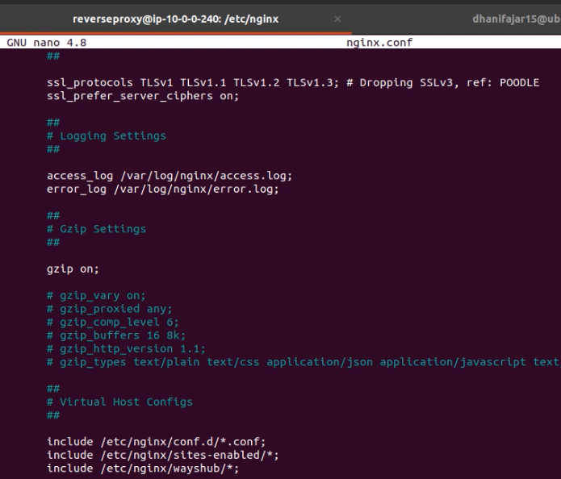
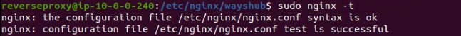
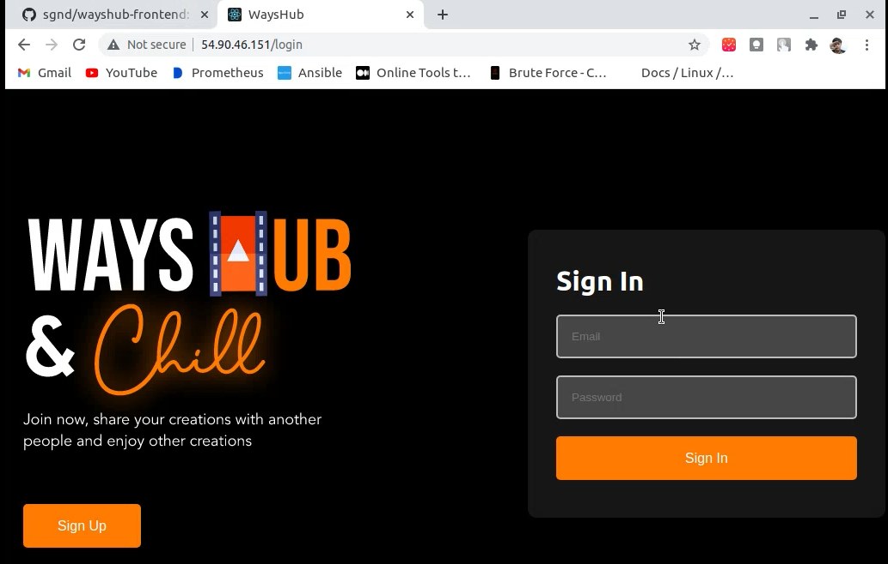

# AWS - Reverse Proxy

## 1. Install Webserver Nginx di Reverse Proxy Server
Remote server reverse proxy dengan ssh 


Update dan Upgrade OS di Reverse Proxy dengan Command
```
sudo apt update && sudo apt -y upgrade
```


Kemudian Install Nginx dengan Command dan tes pada browser dengan menggunakan Public IPv4 address
```
sudo apt -y install nginx
```


Kemudian Pindah Ke Direktori `/etc/nginx/` kemudian buat direktori baru `wayshub` dan buat file `frontend.conf`


isi file `frontend.conf`
```
    server {
	listen 80;
	listen [::]:80;

	server_name 54.90.46.151;

	location / {
		proxy_pass http://10.0.100.99:3000;
	}
}
```


Kemudian tambahkan folder `wayshub`  di `nginx.conf`


Cek syntax untuk memastikan tidak ada kesalahan dengan
```
sudo nginx -t
```


Restart Nginx dengan command
```
sudo systemctl restart nginx
```


Tes akses dengan memasukkan IP lewat browser

