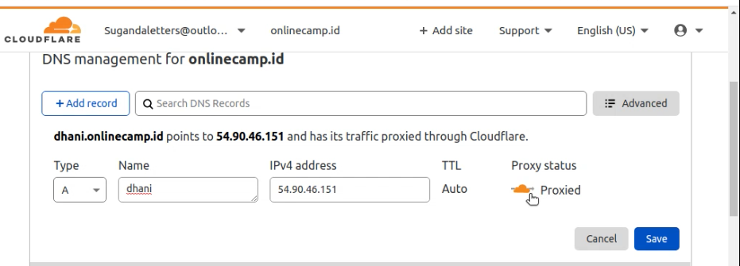

# AWS - Custom Domain

Tambahkan Subdomain DNS di Cloudfare

Buat direktori `.secrets` di home user

Masuk ke direktori `.secrets` dan buat file dengan nama `cloudflare.ini`

Masukkan email dan api key yang telah terdaftar di cloudflare

Ubah hak akses direktori `.secrets`

Ubah hak akses file `cloudflare.ini`

Ubah hak ases direktori `.secrets`

Install certbot dengan perintah`sudo snap install --classic certbot`

Install CloudFlare DNS authenticator plugin

Jalankan certbot dengan Cloudflare authenticator dengan command`sudo certbot certonly --dns-cloudflare --dns-cloudflare-credentials /root/.secrets/cloudflare.ini -d dhani.online.camp.id --preferred-challenges dns-01`

Ubah proxy status menjadi DNS only

Ubah file `etc/nginx/wayshub/frontend.conf` bagian server name menjadi DNS `dhani.onlinecamp.id`

Restart nginx dan masukkan Subdomain di Browser
