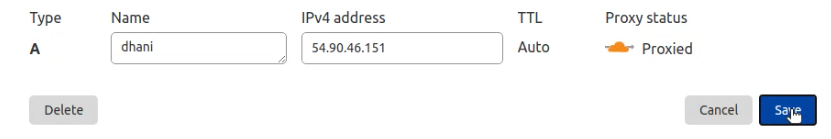
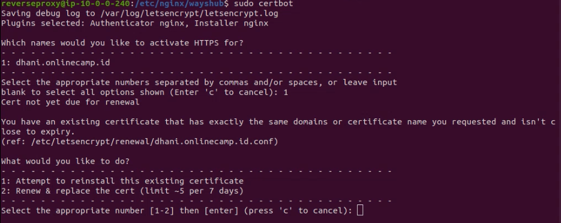
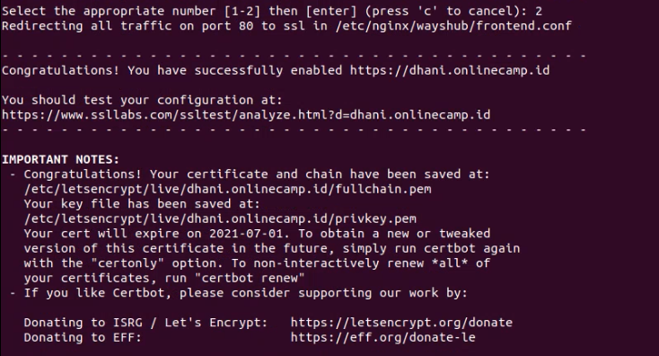
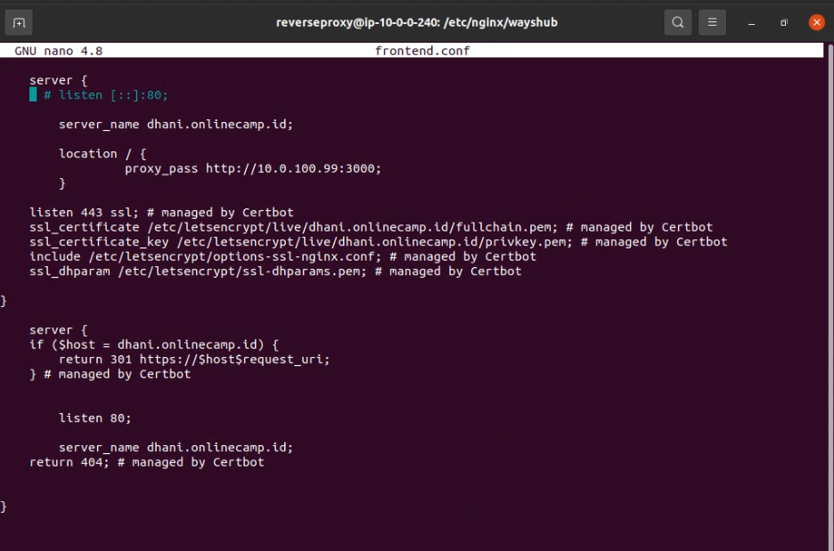
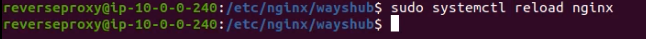
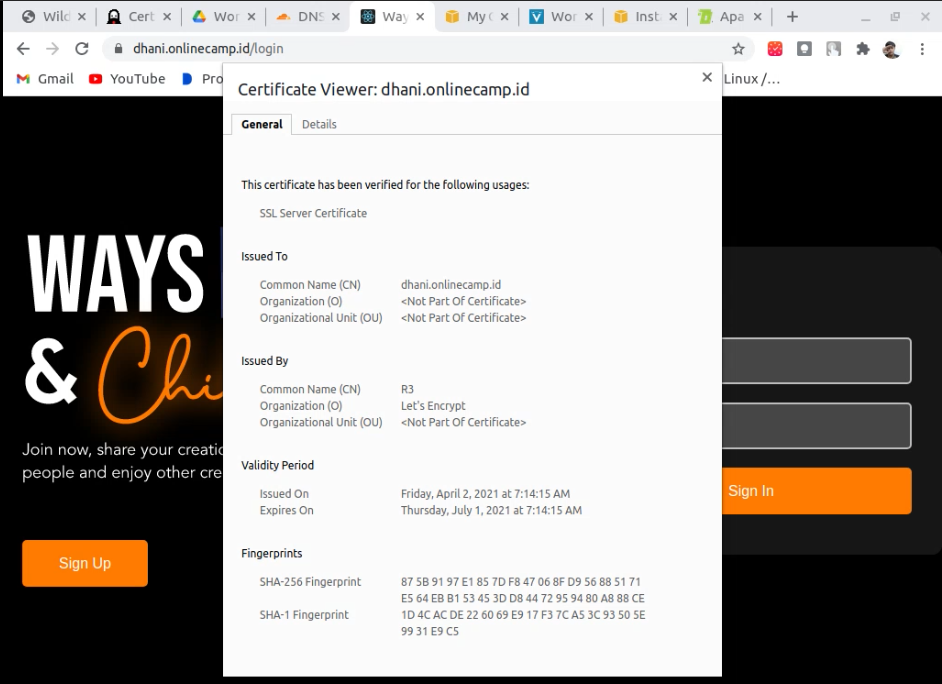

# AWS - SSL Configuration

Ubah proxy status menjadi `Proxied`


Aktivasi HTTPS dengan command
```
sudo certbot
```



Cek apakah HTTPS sudah ter-regenerate di file frontend.conf pada `/etc/nginx/wayshub/frontend.conf` 


Reload nginx setelah melakukan perubahan  dengan command
```
sudo systemctl reload nginx
```


Tes akses ke browser dengan memasukkan domain dan cek certificate
```
https://dhani.onlinecamp.id
```
