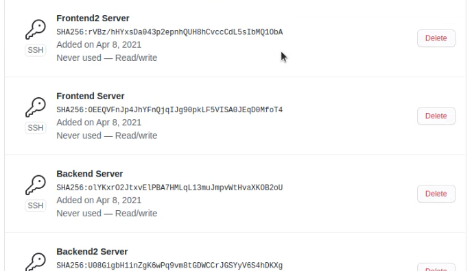

# Install Git and SSH Key

#### Membuat ssh key dengan command
```ssh-keygen -t rsa -b 4096 -C "dhanifajar15@gmail.com"```


#### Copy key ke github
```cat ~/.ssh/id_rsa.pub```


#### Masuk ke Github -> Setting -> SSH and GPG Keys -> Klik New SSH Key lalu copy dan klik add SSH key




#### SSH ke Github dengan command 
```ssh -T git@github.com```

