* # AWS Setup Database

* ## Konfigurasi Database Server
### Install dan Konfigurasi MySQ di Server Database 1

#### Install paket `mysql-server` dan `mysql-client` dengan command:
```
sudo apt install mysql-server mysql-client
```
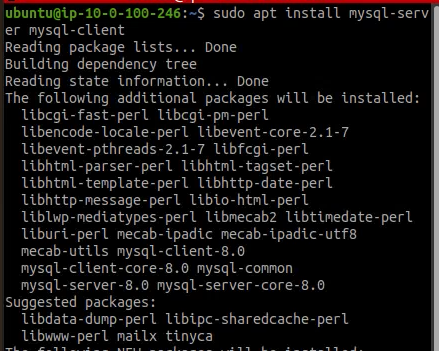

####  Edit file /etc/mysql/mysql.conf.d/mysqld.cnf di database 1
```
server-id              = 1
log_bin                = /var/log/mysql/mysql-bin.log
binlog_do_db           = wayshub
#bind-address          = 127.0.0.1
```
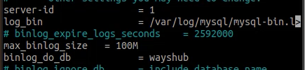

####  Sekarang restart service mysql:
```
sudo systemctl restart mysql.service
```
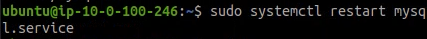

####  Kemudian masuk ke mysql melalui terminal:
```
mysql -u root -p
```
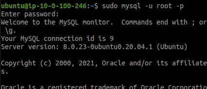

#### membuat pseudo-user yang nanti akan mereplikasi database antara 2 server
```
create user 'replicator'@'%' identified by 'dhani';
```
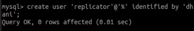

####  Buat juga database yang akan di replikasi.
```
create database wayshub;
```
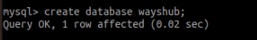

####  Kemudian berikan permission ke user agar bisa mereplikasi database:
```
grant replication slave on *.* to 'replicator'@'%';
```
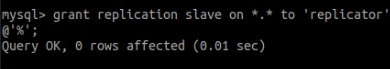

####  mengetahui informasi mengenai status master mysql yang nanti akan dibutuhkan untuk konfigurasi Database 2
```
show master status;
```
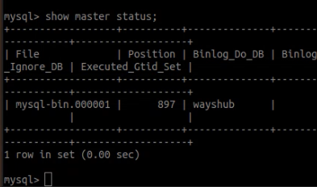

### Install dan Konfigurasi MySQ di Server Database 2

####  Edit file /etc/mysql/mysql.conf.d/mysqld.cnf di database 1
```
server-id              = 2
log_bin                = /var/log/mysql/mysql-bin.log
binlog_do_db           = wayshub
#bind-address          = 127.0.0.1
```
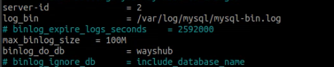


####  Kemudian masuk ke mysql melalui terminal:
```
mysql -u root -p
```
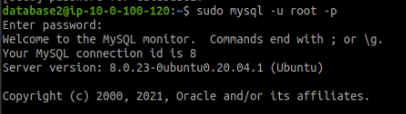

#### membuat pseudo-user yang nanti akan mereplikasi database antara 2 server
```
create user 'replicator'@'%' identified by 'dhani';
```
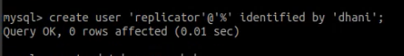

####  Buat juga database yang akan di replikasi.
```
create database wayshub;
```
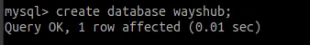

####  Kemudian berikan permission ke user agar bisa mereplikasi database:
```
grant replication slave on *.* to 'replicator'@'%';
```
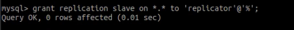

####  Mengaktifkan replikasi dari Server A ke Server B, sesuaikan dengan informasi yang ada di database 1
```
stop slave; 
CHANGE MASTER TO MASTER_HOST = '10.0.100.221', MASTER_USER = 'replicator', MASTER_PASSWORD = 'dhani', MASTER_LOG_FILE = 'mysql-bin.000001', MASTER_LOG_POS = 107; 
start slave; 
```
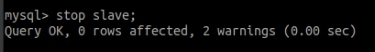
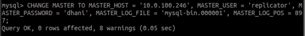
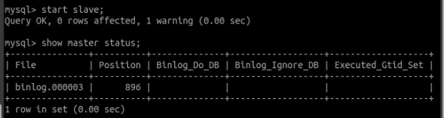

####  mengetahui informasi mengenai status master mysql yang nanti akan dibutuhkan untuk konfigurasi Database 1
```
show master status;
```
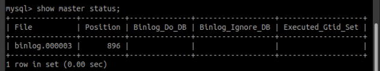

### Konfigurasi Slave Server di Database 1 Server

####  Mengaktifkan replikasi dari Server B ke Server A, sesuaikan drngan informasi yang ada di database 2
```
stop slave; 
CHANGE MASTER TO MASTER_HOST = '10.0.100.221', MASTER_USER = 'replicator', MASTER_PASSWORD = 'dhani', MASTER_LOG_FILE = 'mysql-bin.000001', MASTER_LOG_POS = 107; 
start slave; 
```
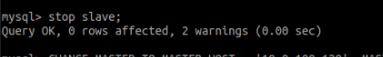
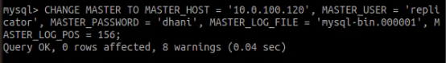
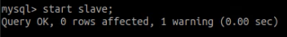

 
