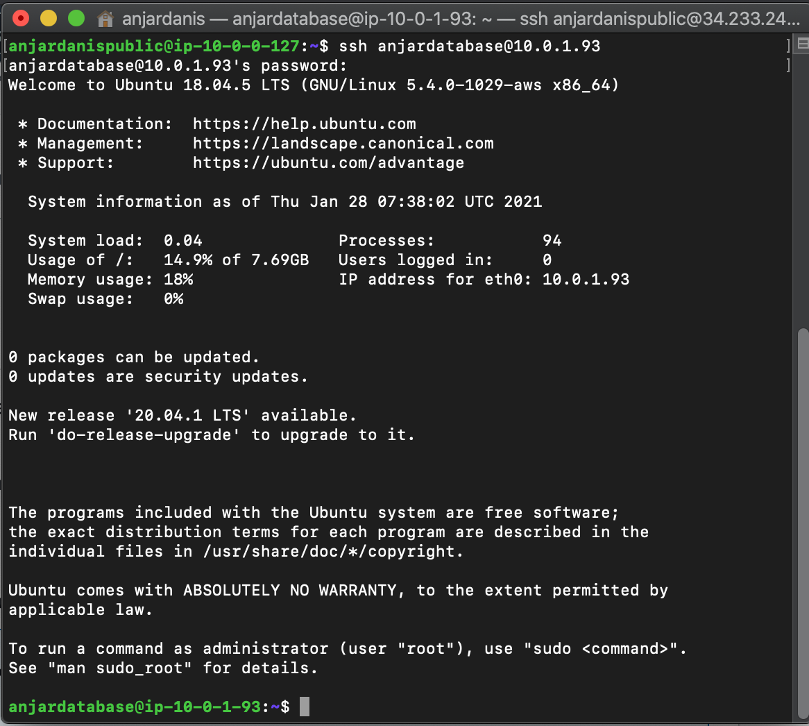
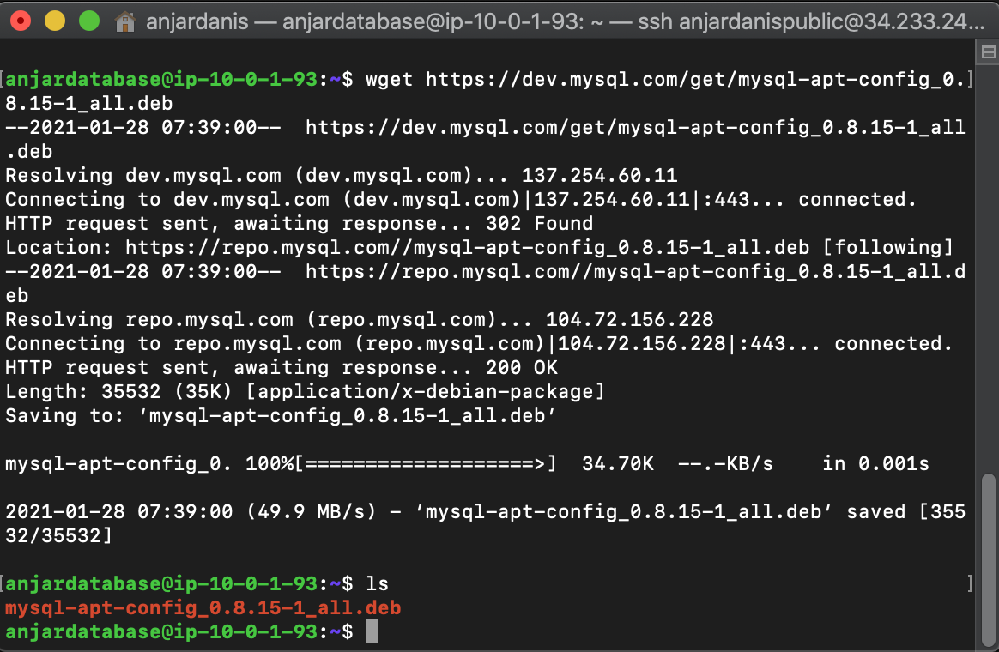

* # AWS Setup Database

* ## Konfigurasi Database Server
### Install dan Konfigurasi MySQ di Server Database 1 


#### Install paket `mysql-server` dan `mysql-client` dengan command:
```
sudo apt install mysql-server mysql-client
```


####  Edit file /etc/mysql/mysql.conf.d/mysqld.cnf di database 1
```
server-id              = 1
log_bin                = /var/log/mysql/mysql-bin.log
binlog_do_db           = wayshub
#bind-address          = 127.0.0.1
```


####  Sekarang restart service mysql:
```
sudo systemctl restart mysql.service
```


####  Kemudian masuk ke mysql melalui terminal:
```
mysql -u root -p
```


#### membuat pseudo-user yang nanti akan mereplikasi database antara 2 server
```
create user 'replicator'@'%' identified by 'dhani';
```


####  Buat juga database yang akan di replikasi.
```
create database wayshub;
```


####  Kemudian berikan permission ke user agar bisa mereplikasi database:
```
grant replication slave on *.* to 'replicator'@'%';
```


####  mengetahui informasi mengenai status master mysql yang nanti akan dibutuhkan untuk konfigurasi Database 2
```
show master status;
```


### Install dan Konfigurasi MySQ di Server Database 2

#### Install paket `mysql-server` dan `mysql-client` dengan command:
```
sudo apt install mysql-server mysql-client
```


####  Edit file /etc/mysql/mysql.conf.d/mysqld.cnf di database 1
```
server-id              = 2
log_bin                = /var/log/mysql/mysql-bin.log
binlog_do_db           = wayshub
#bind-address          = 127.0.0.1
```


####  Sekarang restart service mysql:
```
sudo systemctl restart mysql.service
```


####  Kemudian masuk ke mysql melalui terminal:
```
mysql -u root -p
```


#### membuat pseudo-user yang nanti akan mereplikasi database antara 2 server
```
create user 'replicator'@'%' identified by 'dhani';
```


####  Buat juga database yang akan di replikasi.
```
create database wayshub;
```


####  Kemudian berikan permission ke user agar bisa mereplikasi database:
```
grant replication slave on *.* to 'replicator'@'%';
```


####  Mengaktifkan replikasi dari Server A ke Server B, sesuaikan dengan informasi yang ada di database 1
```
stop slave; 
CHANGE MASTER TO MASTER_HOST = '10.0.100.221', MASTER_USER = 'replicator', MASTER_PASSWORD = 'dhani', MASTER_LOG_FILE = 'mysql-bin.000001', MASTER_LOG_POS = 107; 
start slave; 
```


####  mengetahui informasi mengenai status master mysql yang nanti akan dibutuhkan untuk konfigurasi Database 1
```
show master status;
```


### Konfigurasi Slave Server di Database 1 Server

####  Mengaktifkan replikasi dari Server B ke Server A, sesuaikan drngan informasi yang ada di database 2
```
stop slave; 
CHANGE MASTER TO MASTER_HOST = '10.0.100.221', MASTER_USER = 'replicator', MASTER_PASSWORD = 'dhani', MASTER_LOG_FILE = 'mysql-bin.000001', MASTER_LOG_POS = 107; 
start slave; 
```


* ## Load Balance MySQL dengan Haproxy
#### Pertama kita harus membuat 2 user di MySQL server yang nantinya akan digunakan oleh si HAProxy. User pertama akan digunakan si HAProxy untuk mengecek status dari si server.
```
root@database# mysql -u root -p -e "INSERT INTO mysql.user (Host,User) values ('172.19.0.254','haproxy_check'); FLUSH PRIVILEGES;"
```


#### User yang kedua harus memilki privileges setara dengan root yang nanti digunakan si HAProxy untuk mengakses server
```
mysql -u root -p -e "GRANT ALL PRIVILEGES ON *.* TO 'haproxy_root'@'172.19.0.254' IDENTIFIED BY 'dhani' WITH GRANT OPTION; FLUSH PRIVILEGES"
```


####   Menginstall MySql client di Load Balancer
```
apt-get install mysql-client
```


####  Tes untuk melihat database yang ada di Master dengan menggunakan user haproxy_root.
```
mysql -h 172.19.0.1 -u haproxy_root -p -e "SHOW DATABASES"
```


####  Install paket haproxy di server Load Balancer
```
apt-get install haproxy
```


####  Enable HAProxy
```
sed -i "s/ENABLED=0/ENABLED=1/" /etc/default/haproxy
```


####  Backup file /etc/haproxy/haproxy.cfg
```
cp /etc/haproxy/haproxy.cfg /etc/haproxy/haproxy.cfg.bak
```


####   Edit file tersebut
```
nano /etc/haproxy/haproxy.cfg
```


####  Tambahkan baris berikut
```
global
    log 127.0.0.1 local0 notice
    user haproxy
    group haproxy

defaults
    log global
    retries 2
    timeout connect 3000
    timeout server 5000
    timeout client 5000

listen mysql-cluster
    bind 0.0.0.0:3306
    mode tcp
    option mysql-check user haproxy_check
    balance roundrobin
    server mysql-1 172.19.0.1:3306 check
    server mysql-2 172.19.0.2:3306 check weight 2
```


####  Sekarang tinggal jalankan service dari HAProxy
```
service haproxy start
```


#### Tes untuk menampilkan database di HAProxy
```
mysql -h 127.0.0.1 -u haproxy_root -p -e "SHOW DATABASES"
```


####  Testing Load Balancing dengan menjalankan query menjalankan query dua kali.
```
mysql -h 127.0.0.1 -u haproxy_root -p -e "show variables like 'server_id'"
```


