# Deployment Backend

#### Install nvm dengan Command
```
curl -o- https://raw.githubusercontent.com/nvm-sh/nvm/v0.38.0/install.sh | bash
```
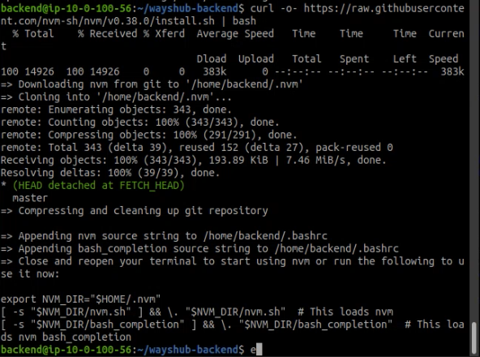

#### Install nvm dengan versi lts paling latest

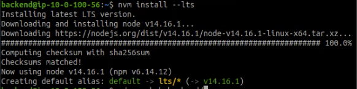

#### Git clone ke repo dikrektori library backend dengan command
```
git clone git@github.com:sgnd/wayshub-backend.git
```

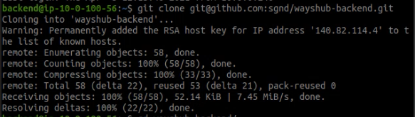


#### Ubah isi file `/config/config.json` dan isi sesuai ip dari instance load balancer database
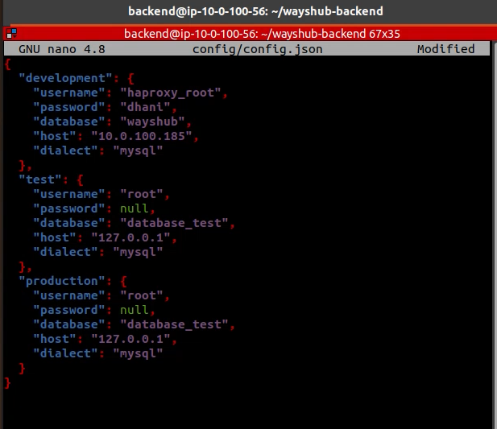


#### Install packages `npm install` dan pm2 `sudo npm install -g pm2` dan buat file `ecosystem.config.js`
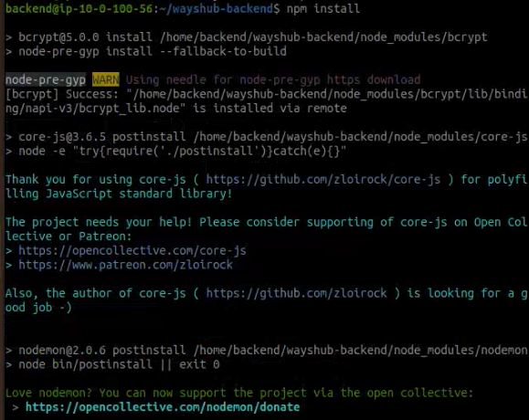
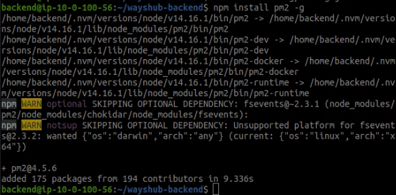

```

module.exports = {
        apps: [
          {
            name: 'wayshub-backend',
            script: 'npm',
            args: 'start'
           }
        ]
};
```

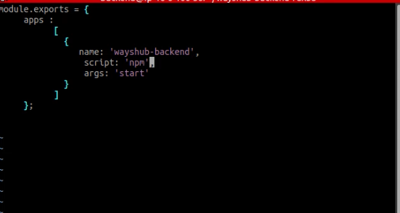

#### Install packages untuk migrate database dengan command `npm install -g sequelize-cli` 

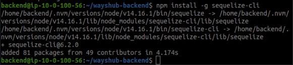

#### Lakukan migrasi database dengan command `sequelize db:migrate all` dan `sequelize db:seed:all` jika gagal install `sudo npm install -g mysql2` terlebih dahulu

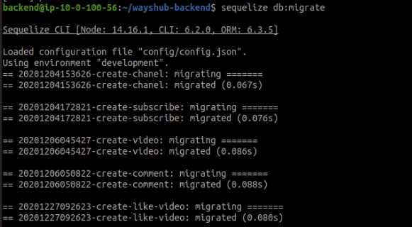

#### Jalankan command `pm2 start ecosystem.config.js`

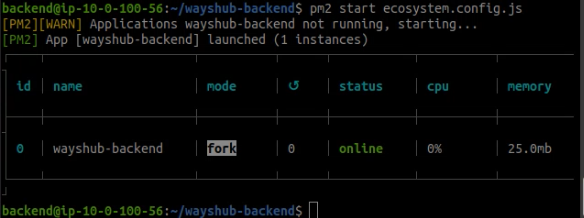

## Pada Frontend Server

#### Edit file di server frontend pada /config/config.js dan ganti base url dengan ip backend server dan lakukan command 
```
pm2 restart ecosystem.config.js
```

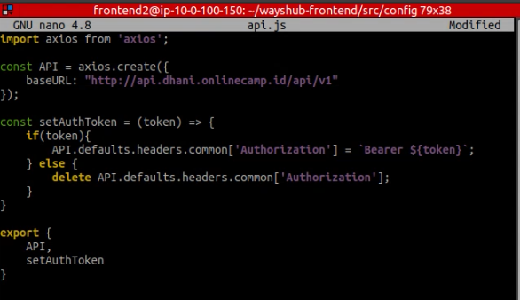

