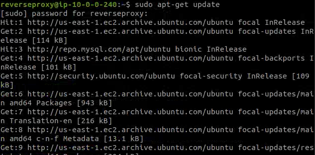
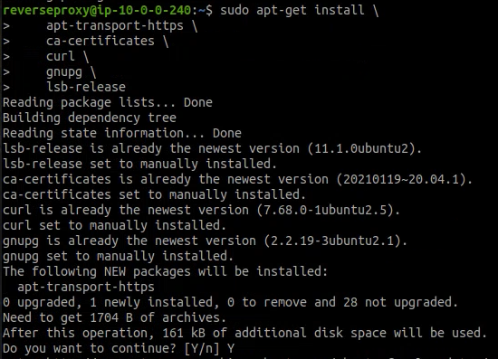
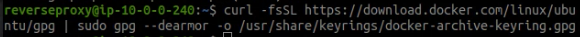
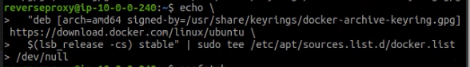
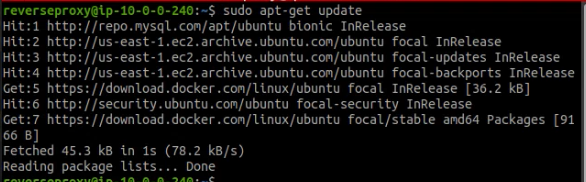
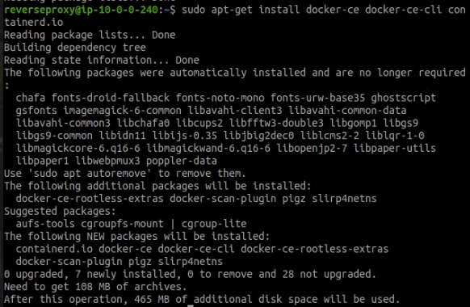

# Install Docker

* #### Update apt package dan install package
```
sudo apt-get update
```




```
sudo apt-get install \
    apt-transport-https \
    ca-certificates \
    curl \
    gnupg \
    lsb-release
```




* #### Tambahkan Docker's official GPG key
```
curl -fsSL https://download.docker.com/linux/ubuntu/gpg | sudo gpg --dearmor -o /usr/share/keyrings/docker-archive-keyring.gpg
```



* #### Set up stable repository
```
echo \
  "deb [arch=amd64 signed-by=/usr/share/keyrings/docker-archive-keyring.gpg] https://download.docker.com/linux/ubuntu \
  $(lsb_release -cs) stable" | sudo tee /etc/apt/sources.list.d/docker.list > /dev/null
```




* #### Update APT dan install Docker Engine dengan versi terbaru
```
sudo apt-get update
sudo apt-get install docker-ce docker-ce-cli containerd.io
```





