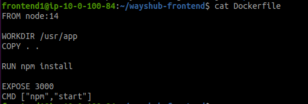
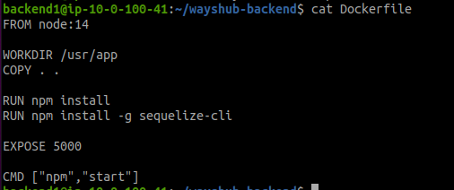
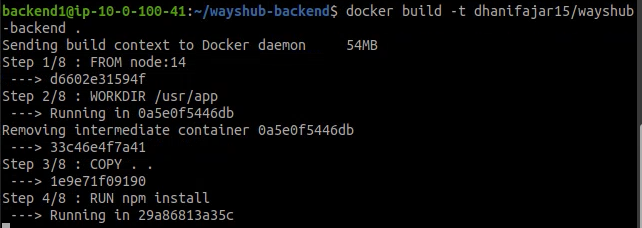
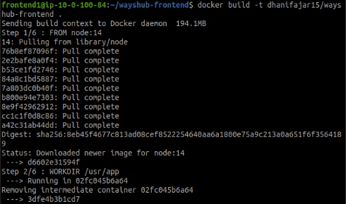
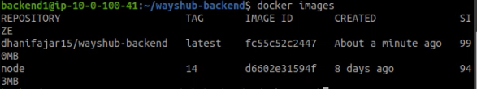
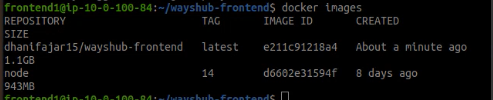
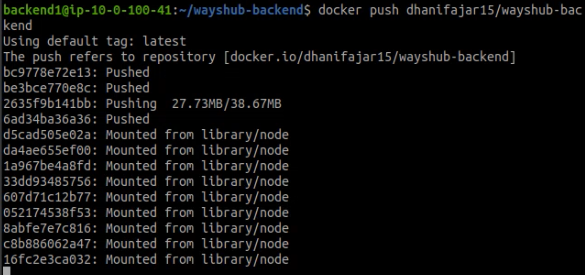
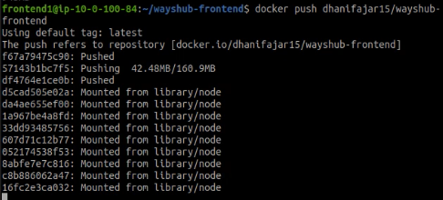

# Create Docker Image

* #### Buat file `Dockerfile` pada Frontend and Backend
Frontend
```
FROM node:14
WORKDIR /usr/app
COPY . .
RUN npm instaZll
EXPOSE 3000
CMD ["npm","start"] 
```
Backend
```
FROM node:14
WORKDIR /usr/app
COPY . .
RUN npm install
EXPOSE 5000
CMD ["npm","start"] 
```



* #### Build dengan command
```
docker build -t namaimage:tag .
```






* #### check pada `docker images`





* #### Kemudian Push
```
docker push dhanifajar15:wayshub-frontend
```


```
docker push dhanifajar15:wayshub-backend
```




