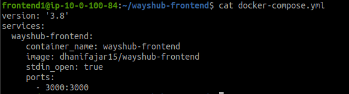
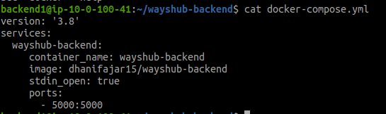
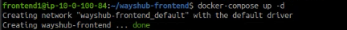
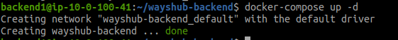

# Install Application

* ## Menggunakan Docker Compose
* #### Buat file `docker-compose.yml` dan isi file
Frontend
```
version: '3.8'
services:
  library-frontend:
     container_name: wayshub-frontend
     image: dhanifajar15/wayshub-frontend
     stdin_open: true
     ports:
       - 3000:3000

```



Backend
```
version: '3.8'
services:
  library-backend:
     container_name: wayshub-backend
     image: dhanifajar15/wayshub-backend
     stdin_open: true
     ports:
       - 5000:5000

```


* #### Jalankan docker compose up




