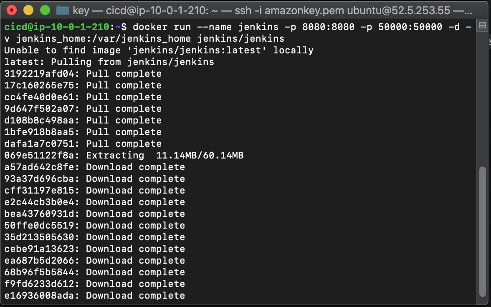
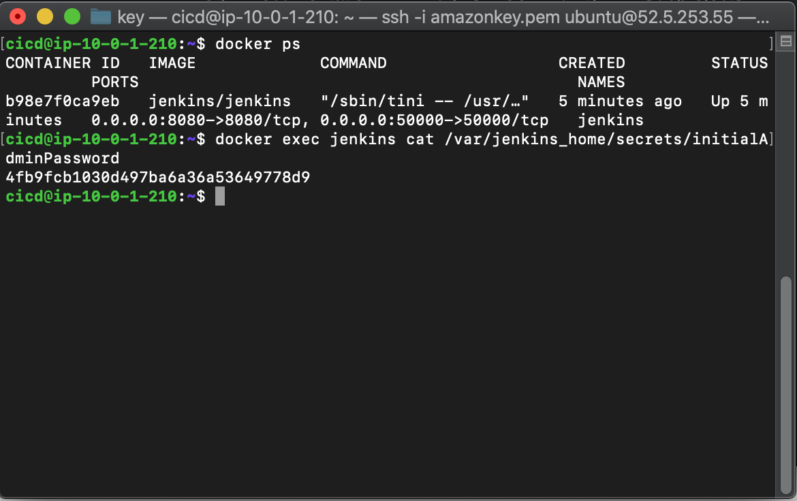
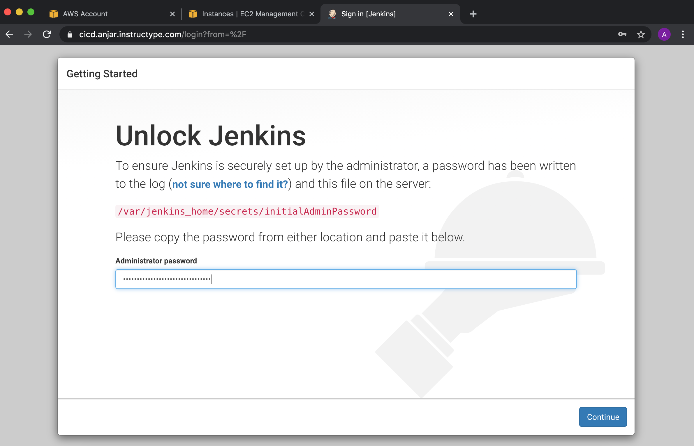
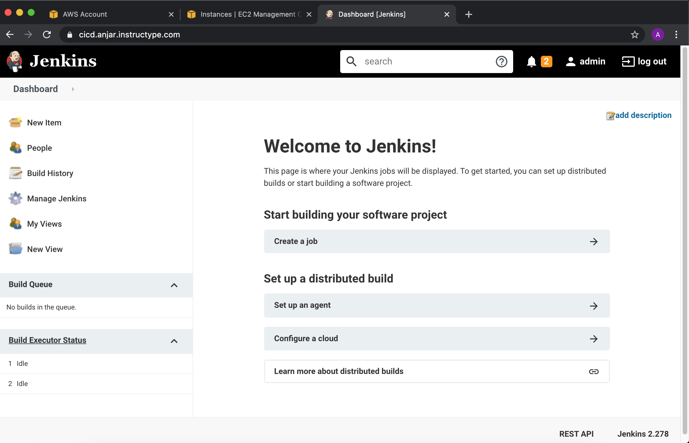
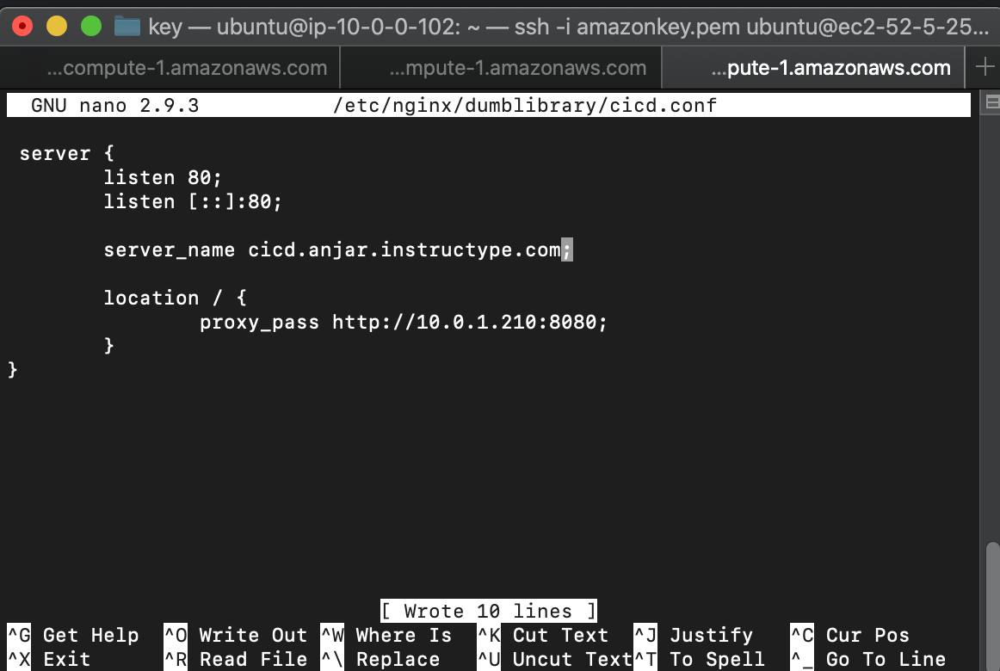
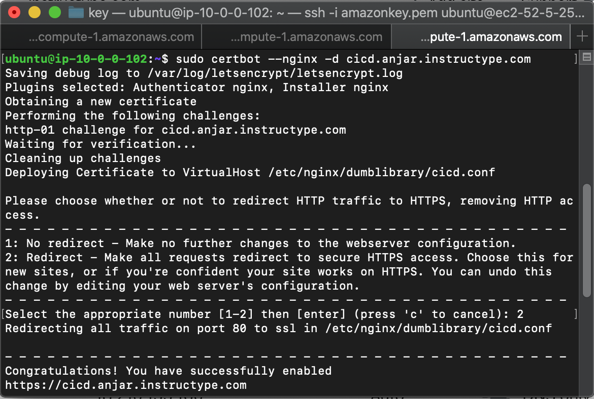

# Install Jenkins

* #### Menginstall jenkins dari docker dengan command
```
docker run -p 8080:8080 -p 50000:50000 -d -v jenkins_home:/usr/app jenkins/jenkins:lts
```


* #### Dapatkan initial password dengan command
```
docker exec -it ${CONTAINER_ID or CONTAINER_NAME} cat /var/jenkins_home/secrets/initialAdminPassword
```


* #### buka `cicd.anjar.instructype.com` dan masukkan inital password


* #### ikuti petunjuk daftar mengisi username dan instalasi jenkins



* ## Pindah pada Reverse Proxy buat file jenkins.conf pada /etc/nginx reverse proxy


* #### Buat file jenkins.conf dan lakukan SSL configuration
`sudo certbot --nginx -d cicd.anjar.instructype.com`
