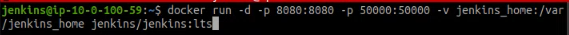
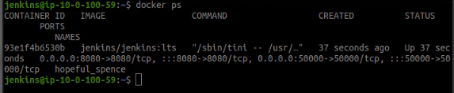
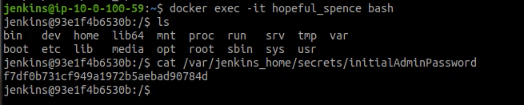
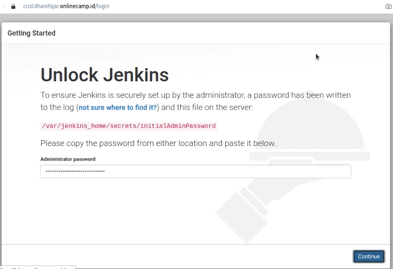
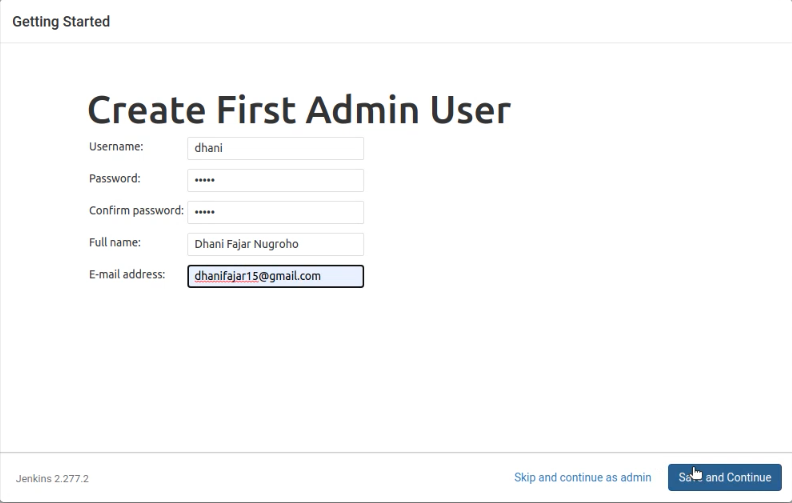
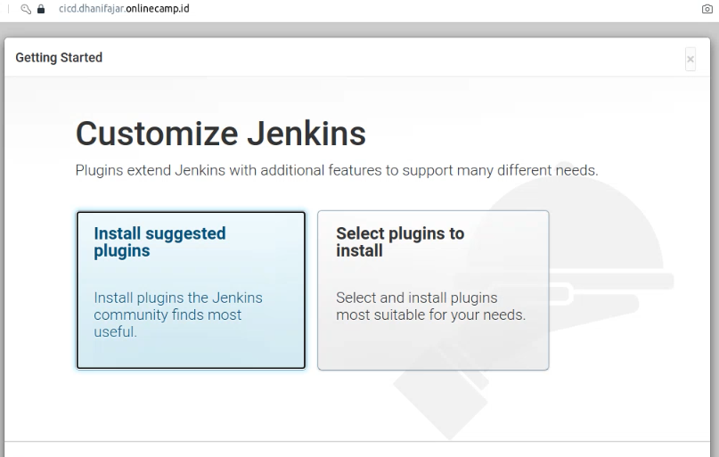
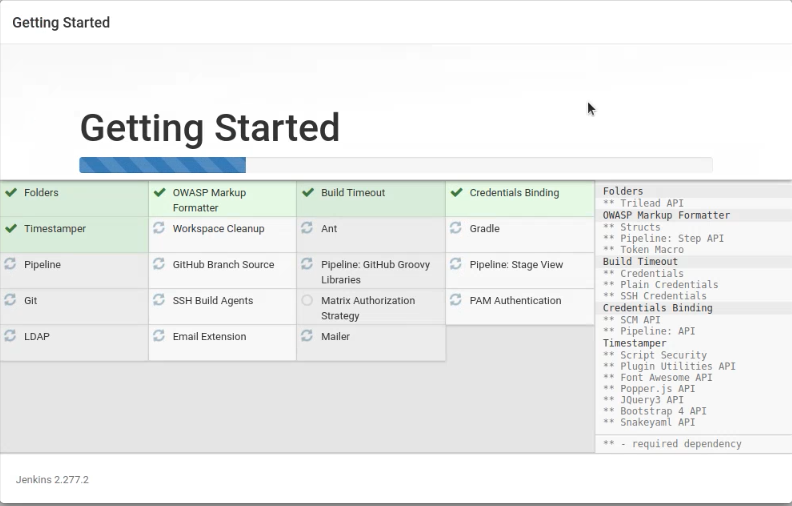

# Install Jenkins

* #### Menginstall jenkins dari docker dengan command
```
docker run -p 8080:8080 -p 50000:50000 -d -v jenkins_home:/usr/app jenkins/jenkins:lts
```


* #### Cek container jenkins untuk memastikan berjalan
```
docker ps
```


* #### Dapatkan initial password dengan command
```
docker exec -it ${CONTAINER_ID or CONTAINER_NAME} 
cat /var/jenkins_home/secrets/initialAdminPassword
```


* #### buka `cicd.dhanifajar.onlinecamp.id` dan masukkan inital password


* #### ikuti petunjuk daftar mengisi username dan instalasi jenkins



* #### Pilih plugin yang direkomendasikan




