# Create Jenkins Jobs

* #### Generate Token Github dengan cara masuk klik Settings > Developer Settings > Personal Access Tokens
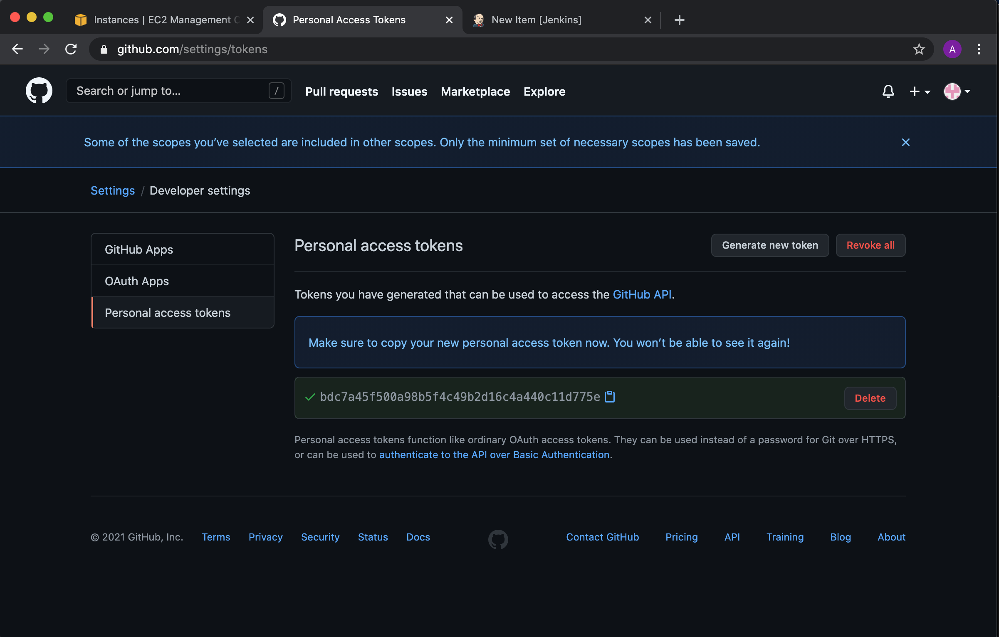

* #### Pilih workflow dan admin:repo_hook
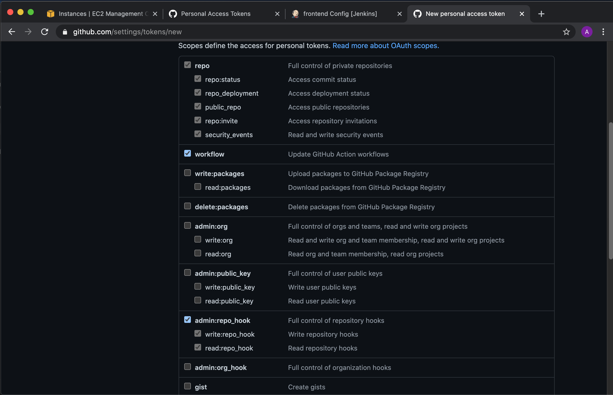

* #### Masuk Ke Credentials dan Tambahan Credential dengan Secret Text kemudian Masuk Configuration Jenkins

* #### Install Plugin Publish Over SSH dan tambahan Server untuk server target buka port 22 dari Server jenkins dan tambahan ssh-keygen jenkins di server frontend dan backend dan atur timeout 0ms
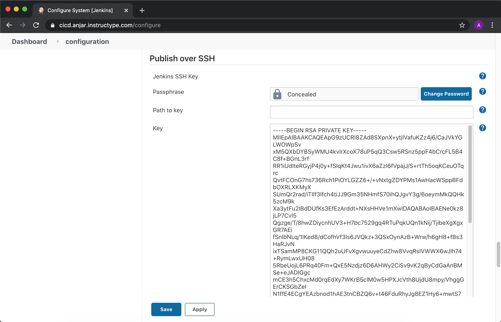
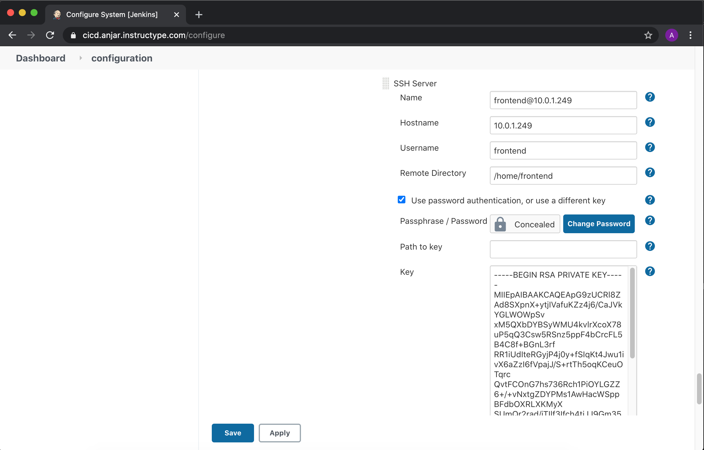
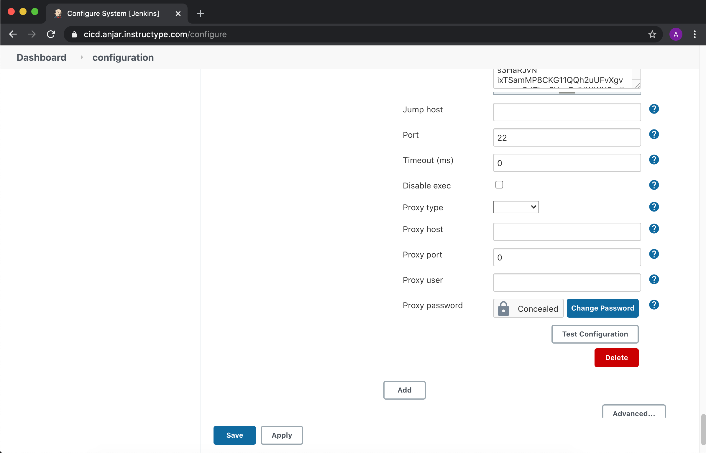

* #### Buat freestyle project
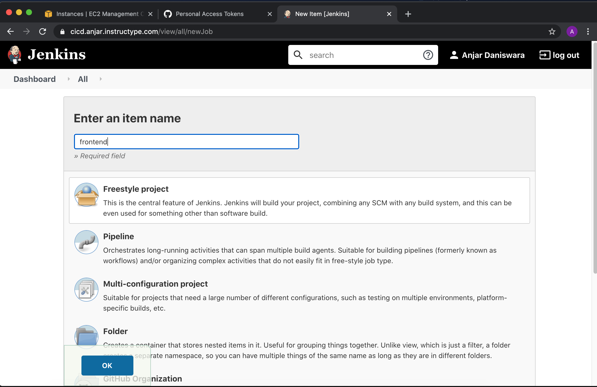

* #### Isi Source Code Management git
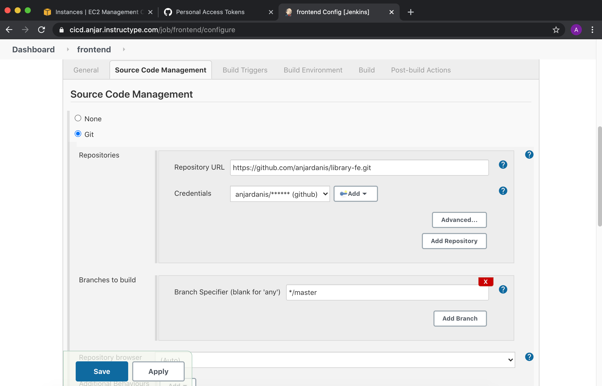

* #### Centang Build Triggers pada pilihan github hook trigger
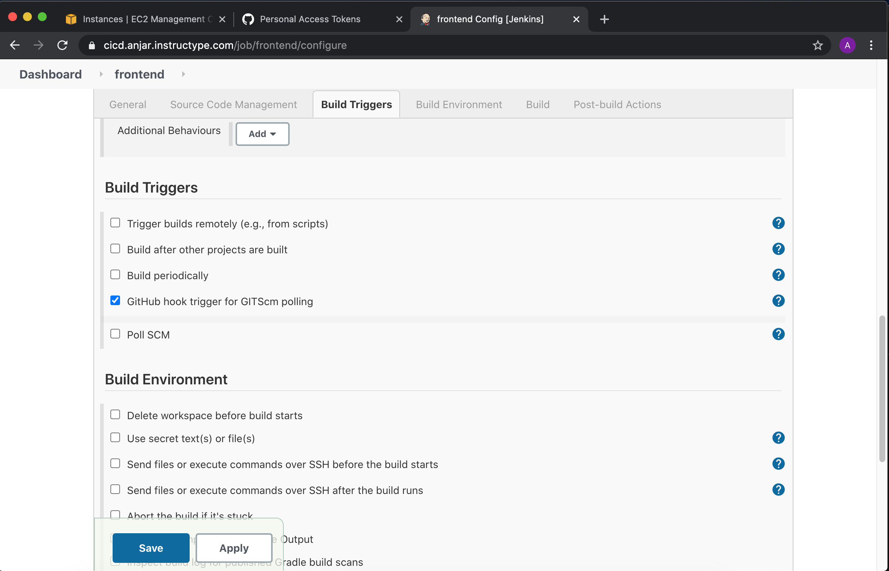

* #### Isi Build
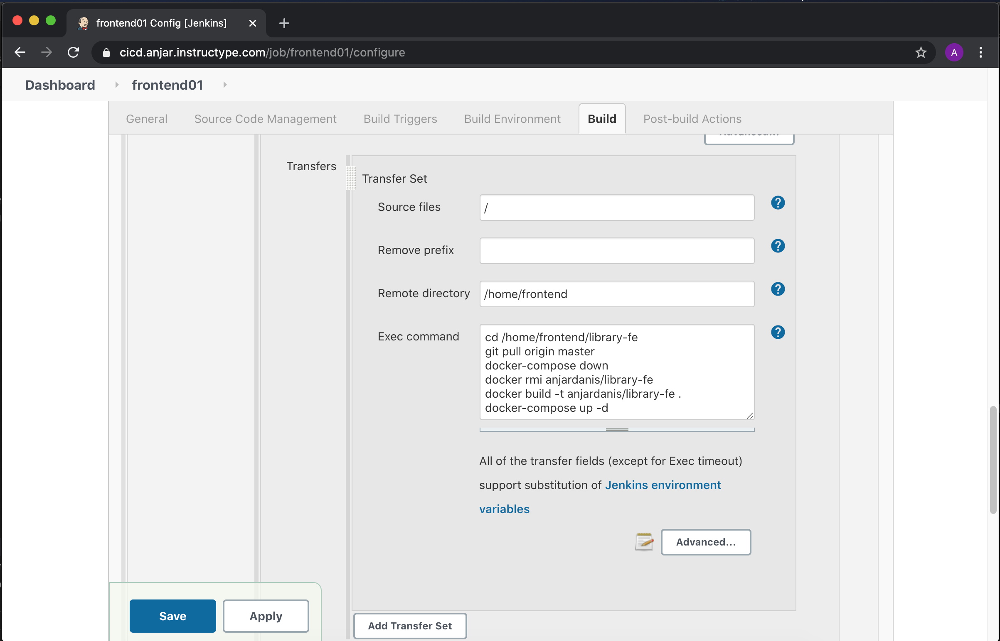
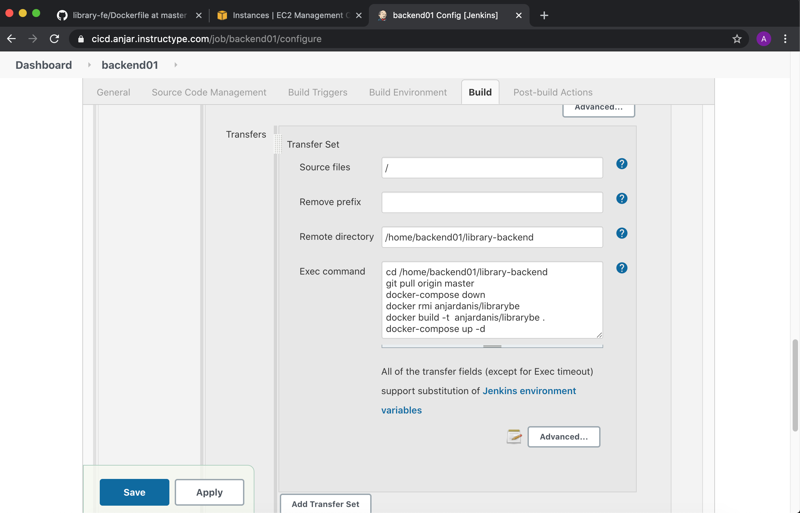

* #### dan atur exec timeout 0
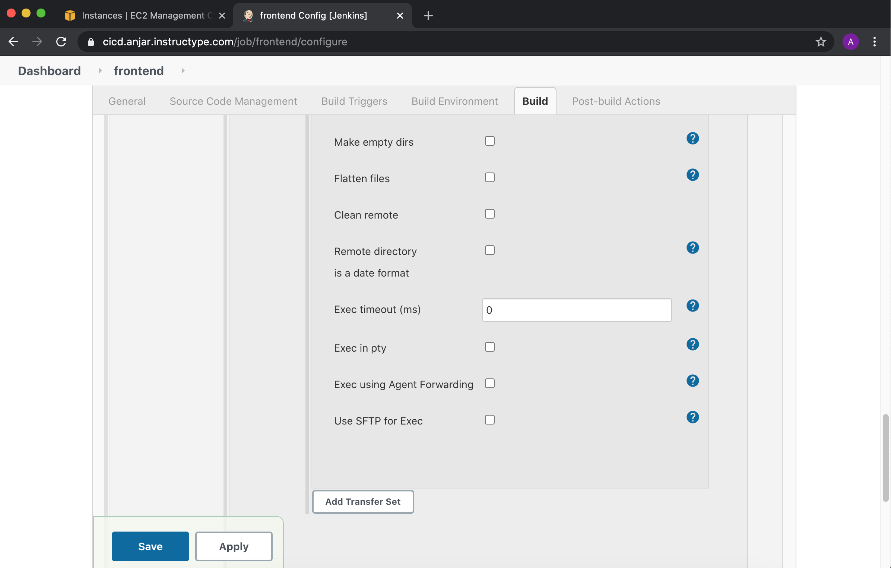

* #### Install Plugin Discord Notifier. Kemudian pada Discord Buat channel. Klik Server Setting > Integrations > Buat Webhook dan Copy
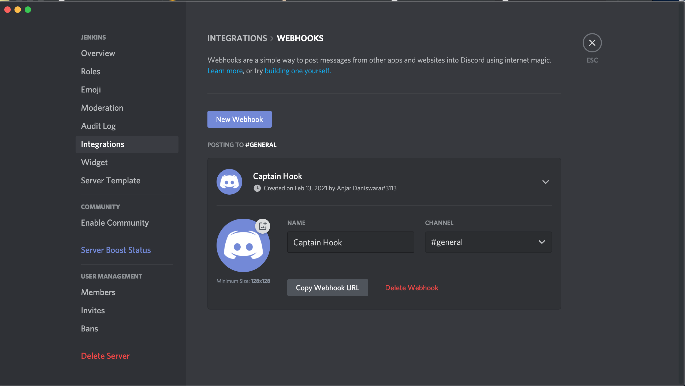

* #### Copy URL pada Post Build
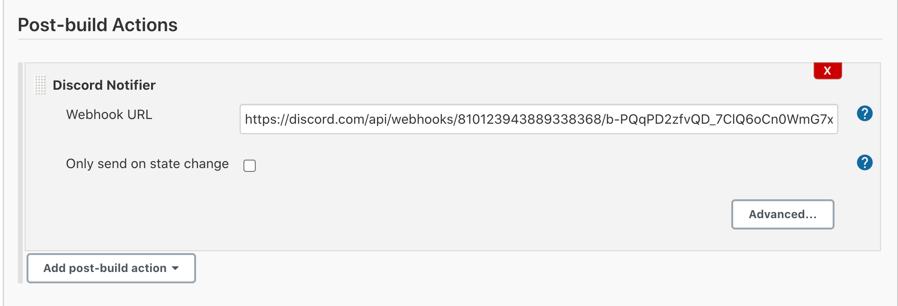

* #### Klik Build dan akan ada notifikasi dari discord
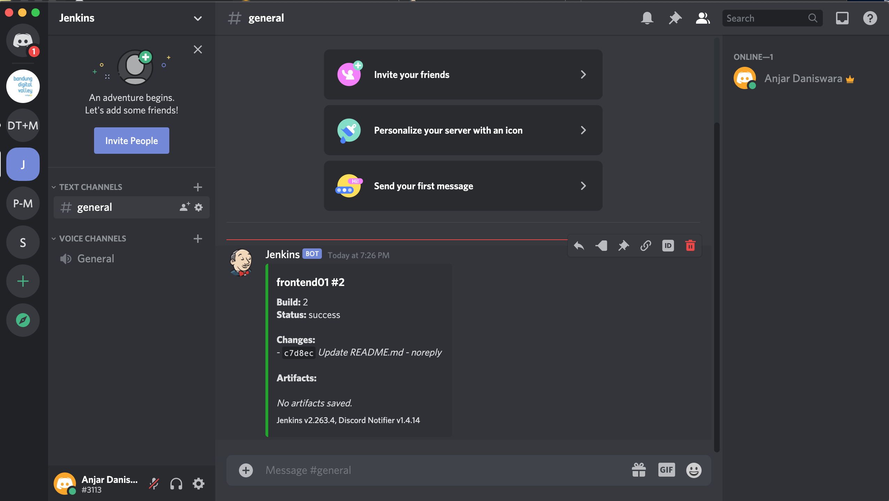
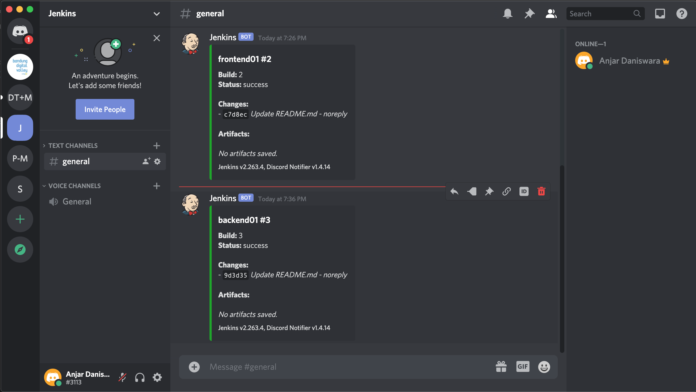

* #### Hasil Akhir Output:
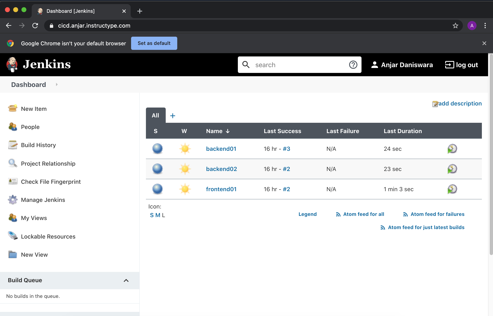