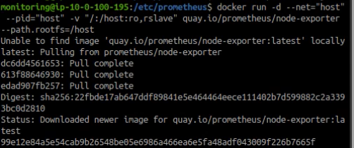
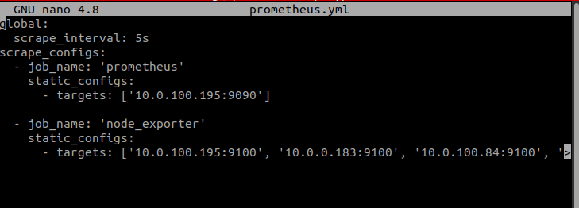
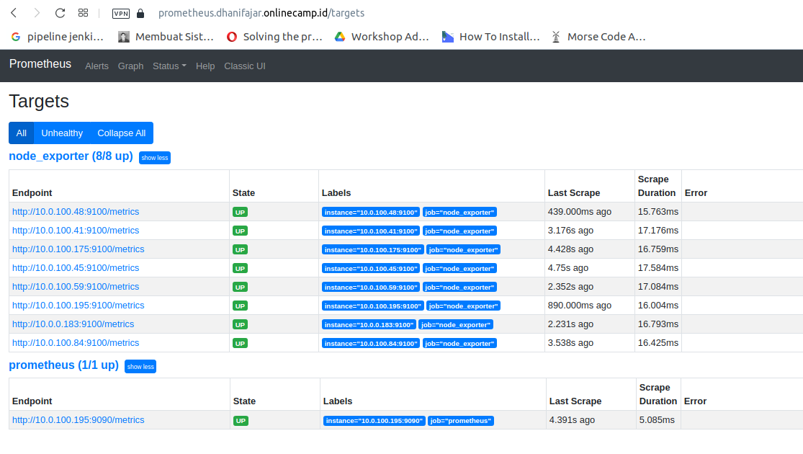
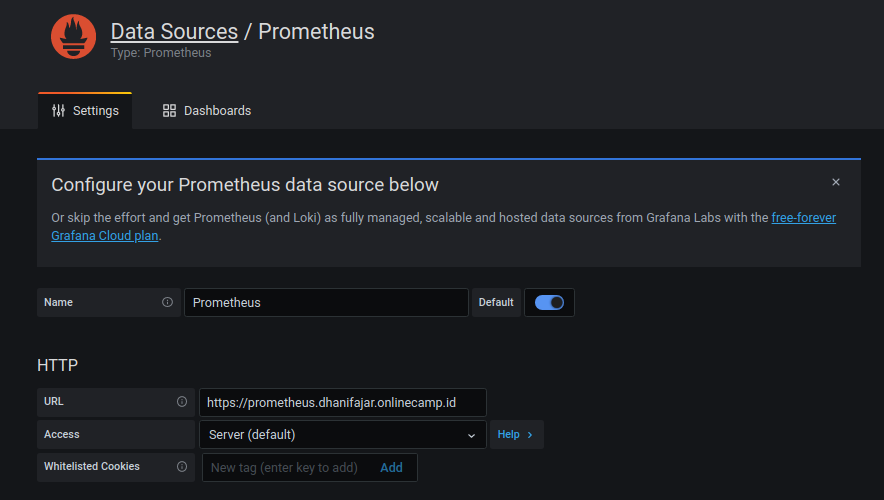
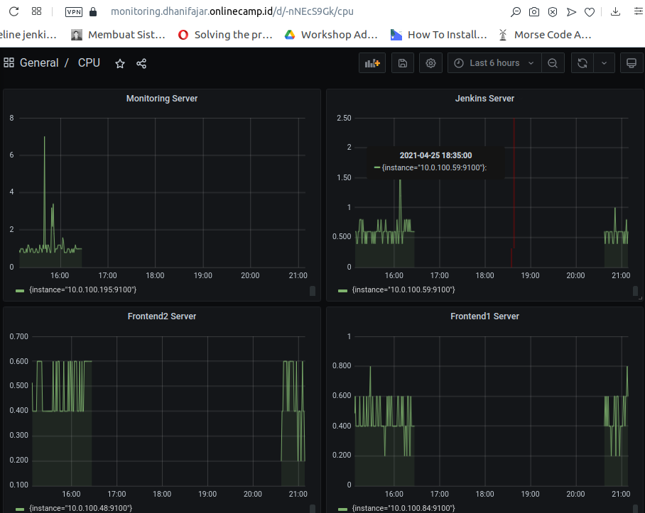
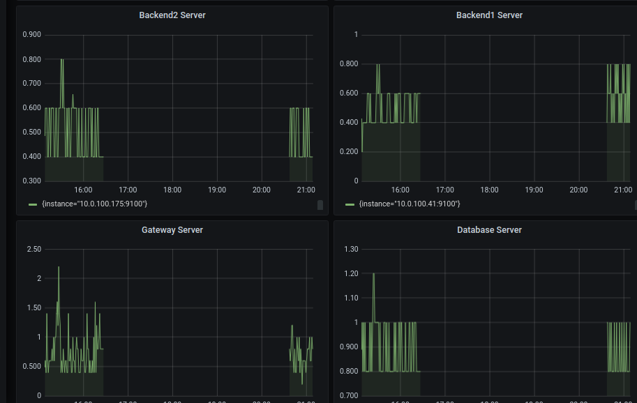
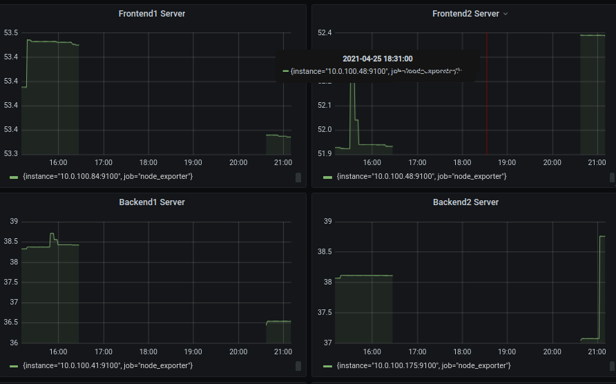
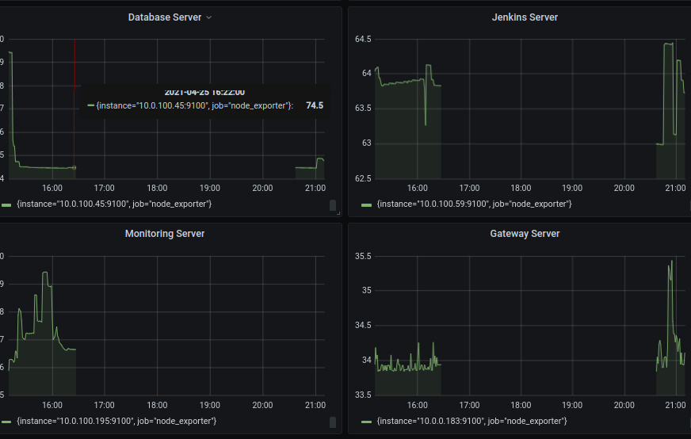

# Connect Multiple Server

* #### Install Node-Exporter pada semua target server (frontend,backend,database,reverseproxy,jenkins,monitoring)
```
docker run -d --net="host" --pid="host" -v "/:/host:ro,rslave" quay.io/prometheus/node-exporter --path.rootfs=/host
```



* #### edit file `prometheus.yml` dan tambahkan ip target


* #### Cek pada prometheus.dhanifajar.onlinecamp.id


* #### tambahkan prometheus pada grafana


* #### Setting dashboard frontend backend

Untuk Query
CPU Usage
```
100 - (avg by(instance)(irate(node_cpu_seconds_total{instance="10.0.1.249:9100",job="node_exporter",mode="idle"}[5m]))*100)
```




Memory Usage
```
(node_memory_MemTotal_bytes{instance="10.0.1.249:9100",job="node_exporter"} - (node_memory_MemFree_bytes{instance="10.0.1.249:9100",job="node_exporter"} +        
node_memory_Cached_bytes{instance="10.0.1.249:9100",job="node_exporter"} + node_memory_Buffers_bytes{instance="10.0.1.249:9100",job="node_exporter"} )) /   
node_memory_MemTotal_bytes{instance="10.0.1.249:9100",job="node_exporter"} * 100
```




