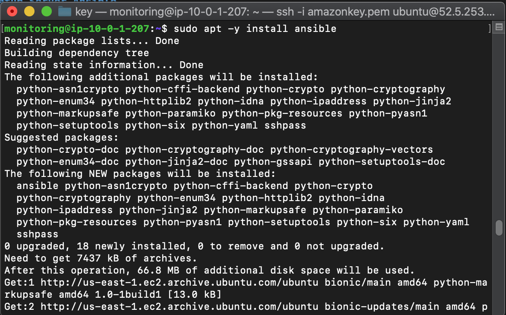

# Setup Server Ansible

* #### Install Ansible pada Monitoring Server dengan command
```
sudo apt -y update && sudo apt -y upgrade
sudo apt-get -y install python3
sudo apt install whois -y
sudo apt-add-repository ppa:ansible/ansible
sudo apt -y install ansible
```


* #### Buat Direktori Baru `Ansible` dan tambahkan file `ansible.cfg`


* #### Buat file `Inventory` yang berisi host semua server dan buat direktori `ssh` yang berisi key


* #### tes ping dikarenakan nginx masih user ubuntu jadi dipisah antara non user dan user


* #### Buat instance frontend baru dan tambahkan di Inventory


* #### lakukan update dan upgrade pada instance frontend baru dengan command
```
ansible new -m apt -a update_cache=true --become
ansible new -m apt -a "upgrade=dist" --become
```


* #### Selanjutnya buat user frontend02 pertama buat password terenkripsi dengan command
```
mkpasswd --method=SHA-512
```
$6$CjI1u8z2chKyEka$ka/CR75ySm.Dchny13kVH6UTFu1jJZsUM9HZnCAQWkiJIgEcgDSjgxGA97Wai5P76AxGf9C9s/O.N/vr2r7gm0


* #### buat file yaml `create_user.yml` dan masukkan password yang terenkripsi


* #### jalan ansible playbook


* #### selanjutnya install docker dan node exporter docker ganti user fe2 di Inventory


* #### buat ssh key untuk git repository


* #### git repository library-fe


* #### lakukan docker build di frontend02 dan run dari ansible


